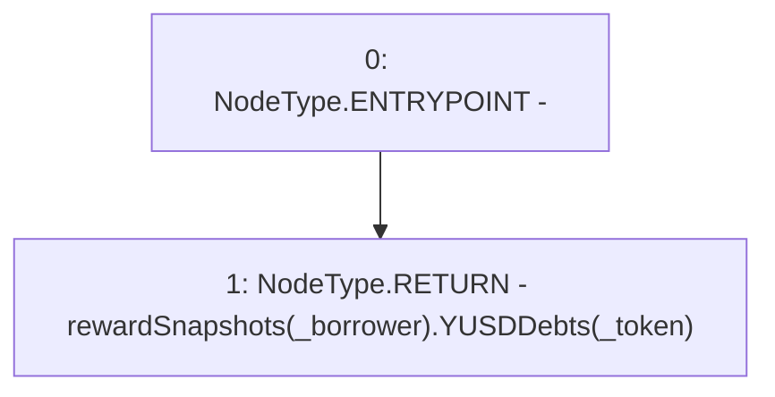

# Context: TroveManagerTester.getRewardSnapshotYUSD

**Contract:** `TroveManagerTester` (Inherits: TroveManager, ReentrancyGuard, ITroveManager, TroveManagerBase, CheckContract, Ownable, LiquityBase, YetiCustomBase, BaseMath, ILiquityBase)
**Signature:** `getRewardSnapshotYUSD(address,address) returns (uint256)`
**Method Selector ID:** `0x50953b62`
**Visibility:** `external`
**Environment-Free:** `Yes`
**Modifiers:** None

### State Variables Interaction
- **Reads:** rewardSnapshots
- **Writes:** None

### Environment & Verification Flags
- **Uses Foundry Cheatcodes:** No
- **Has Echidna Properties:** No

### Internal Calls Tree
- None

### External Calls / Value Transfers
- None

### Control Flow Graph (CFG)


### Source Mapping
Declared in: `certora-ac-datasets/detasets/web3bugs/dataset/web3bugs/66/packages/contracts/contracts/TroveManager.sol` on lines **883** to **885**

```solidity
    function getRewardSnapshotYUSD(address _borrower, address _token) external view override returns (uint) {
        return rewardSnapshots[_borrower].YUSDDebts[_token];
    }

```
