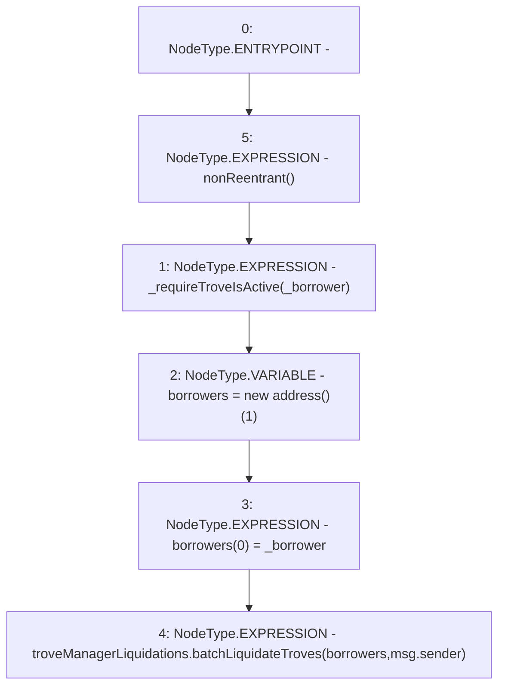

# Context: TroveManagerTester.liquidate

**Contract:** `TroveManagerTester` (Inherits: TroveManager, ReentrancyGuard, ITroveManager, TroveManagerBase, CheckContract, Ownable, LiquityBase, YetiCustomBase, BaseMath, ILiquityBase)
**Signature:** `liquidate(address)`
**Method Selector ID:** `0x2f865568`
**Visibility:** `external`
**Environment-Free:** `No (reads EVM state context)`
**Modifiers:**
- `nonReentrant`
  ```solidity
  modifier nonReentrant() {
          // On the first call to nonReentrant, _notEntered will be true
          require(_status != _ENTERED, "ReentrancyGuard: reentrant call");
  
          // Any calls to nonReentrant after this point will fail
          _status = _ENTERED;
  
          _;
  
          // By storing the original value once again, a refund is triggered (see
          // https://eips.ethereum.org/EIPS/eip-2200)
          _status = _NOT_ENTERED;
      }
  ```

### State Variables Interaction
- **Reads:** troveManagerLiquidations
- **Writes:** None

### Environment & Verification Flags
- **Uses Foundry Cheatcodes:** No
- **Has Echidna Properties:** No

### Internal Calls Tree
- None

### External Calls / Value Transfers
- `ITroveManagerLiquidations.HIGH_LEVEL_CALL, dest:troveManagerLiquidations(ITroveManagerLiquidations), function:batchLiquidateTroves, arguments:['borrowers', 'msg.sender']  `

### Control Flow Graph (CFG)


### Source Mapping
Declared in: `certora-ac-datasets/detasets/web3bugs/dataset/web3bugs/66/packages/contracts/contracts/TroveManager.sol` on lines **201** to **208**

```solidity
    function liquidate(address _borrower) external override nonReentrant {
        _requireTroveIsActive(_borrower);

        address[] memory borrowers = new address[](1);
        borrowers[0] = _borrower;
        // calls this.batchLiquidateTroves so nonReentrant works correctly
        troveManagerLiquidations.batchLiquidateTroves(borrowers, msg.sender);
    }

```
