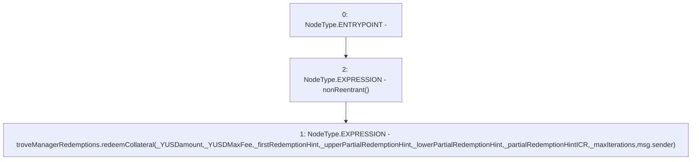

# Context: TroveManagerTester.redeemCollateral

**Contract:** `TroveManagerTester` (Inherits: TroveManager, ReentrancyGuard, ITroveManager, TroveManagerBase, CheckContract, Ownable, LiquityBase, YetiCustomBase, BaseMath, ILiquityBase)
**Signature:** `redeemCollateral(uint256,uint256,address,address,address,uint256,uint256)`
**Method Selector ID:** `0x13312d59`
**Visibility:** `external`
**Environment-Free:** `No (reads EVM state context)`
**Modifiers:**
- `nonReentrant`
  ```solidity
  modifier nonReentrant() {
          // On the first call to nonReentrant, _notEntered will be true
          require(_status != _ENTERED, "ReentrancyGuard: reentrant call");
  
          // Any calls to nonReentrant after this point will fail
          _status = _ENTERED;
  
          _;
  
          // By storing the original value once again, a refund is triggered (see
          // https://eips.ethereum.org/EIPS/eip-2200)
          _status = _NOT_ENTERED;
      }
  ```

### State Variables Interaction
- **Reads:** troveManagerRedemptions
- **Writes:** None

### Environment & Verification Flags
- **Uses Foundry Cheatcodes:** No
- **Has Echidna Properties:** No

### Internal Calls Tree
- None

### External Calls / Value Transfers
- `ITroveManagerRedemptions.HIGH_LEVEL_CALL, dest:troveManagerRedemptions(ITroveManagerRedemptions), function:redeemCollateral, arguments:['_YUSDamount', '_YUSDMaxFee', '_firstRedemptionHint', '_upperPartialRedemptionHint', '_lowerPartialRedemptionHint', '_partialRedemptionHintICR', '_maxIterations', 'msg.sender']  `

### Control Flow Graph (CFG)


### Source Mapping
Declared in: `certora-ac-datasets/detasets/web3bugs/dataset/web3bugs/66/packages/contracts/contracts/TroveManager.sol` on lines **287** to **309**

```solidity
    function redeemCollateral(
        uint _YUSDamount,
        uint _YUSDMaxFee,
        address _firstRedemptionHint,
        address _upperPartialRedemptionHint,
        address _lowerPartialRedemptionHint,
        uint _partialRedemptionHintICR,
        uint _maxIterations
    )
    external
    override
    nonReentrant
    {
        troveManagerRedemptions.redeemCollateral(
            _YUSDamount,
            _YUSDMaxFee,
            _firstRedemptionHint,
            _upperPartialRedemptionHint,
            _lowerPartialRedemptionHint,
            _partialRedemptionHintICR,
            _maxIterations,
            msg.sender);
    }

```
