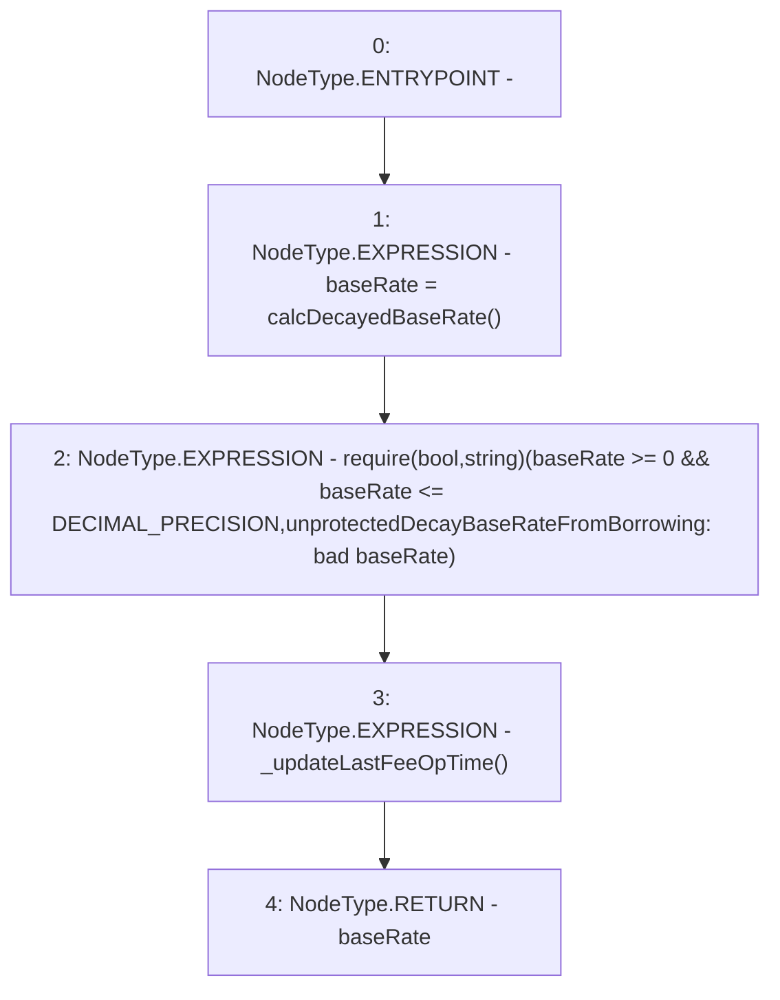

# Context: TroveManagerTester.unprotectedDecayBaseRateFromBorrowing

**Contract:** `TroveManagerTester` (Inherits: TroveManager, ReentrancyGuard, ITroveManager, TroveManagerBase, CheckContract, Ownable, LiquityBase, YetiCustomBase, BaseMath, ILiquityBase)
**Signature:** `unprotectedDecayBaseRateFromBorrowing() returns (uint256)`
**Method Selector ID:** `0xda303f14`
**Visibility:** `external`
**Environment-Free:** `No (reads EVM state context)`
**Modifiers:** None

### State Variables Interaction
- **Reads:** DECIMAL_PRECISION, baseRate
- **Writes:** baseRate

### Assertion Checks & Business Requirements
- require/assert: `require(bool,string)(baseRate >= 0 && baseRate <= DECIMAL_PRECISION,unprotectedDecayBaseRateFromBorrowing: bad baseRate)`

### Environment & Verification Flags
- **Uses Foundry Cheatcodes:** No
- **Has Echidna Properties:** No

### Internal Calls Tree
- None

### External Calls / Value Transfers
- None

### Control Flow Graph (CFG)


### Source Mapping
Declared in: `certora-ac-datasets/detasets/web3bugs/dataset/web3bugs/66/packages/contracts/contracts/TestContracts/CDPManagerTester.sol` on lines **36** to **42**

```solidity
    function unprotectedDecayBaseRateFromBorrowing() external returns (uint) {
        baseRate = calcDecayedBaseRate();
        require(baseRate >= 0 && baseRate <= DECIMAL_PRECISION, "unprotectedDecayBaseRateFromBorrowing: bad baseRate");
        
        _updateLastFeeOpTime();
        return baseRate;
    }

```
