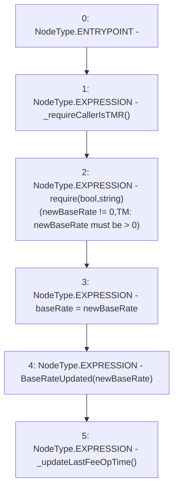

# Context: TroveManagerTester.updateBaseRate

**Contract:** `TroveManagerTester` (Inherits: TroveManager, ReentrancyGuard, ITroveManager, TroveManagerBase, CheckContract, Ownable, LiquityBase, YetiCustomBase, BaseMath, ILiquityBase)
**Signature:** `updateBaseRate(uint256)`
**Method Selector ID:** `0x330283aa`
**Visibility:** `external`
**Environment-Free:** `No (reads EVM state context)`
**Modifiers:** None

### State Variables Interaction
- **Reads:** None
- **Writes:** baseRate

### Assertion Checks & Business Requirements
- require/assert: `require(bool,string)(newBaseRate != 0,TM: newBaseRate must be > 0)`

### Environment & Verification Flags
- **Uses Foundry Cheatcodes:** No
- **Has Echidna Properties:** No

### Internal Calls Tree
- None

### External Calls / Value Transfers
- None

### Control Flow Graph (CFG)


### Source Mapping
Declared in: `certora-ac-datasets/detasets/web3bugs/dataset/web3bugs/66/packages/contracts/contracts/TroveManager.sol` on lines **704** to **710**

```solidity
    function updateBaseRate(uint newBaseRate) external override {
        _requireCallerIsTMR();
        require(newBaseRate != 0, "TM: newBaseRate must be > 0");
        baseRate = newBaseRate;
        emit BaseRateUpdated(newBaseRate);
        _updateLastFeeOpTime();
    }

```
