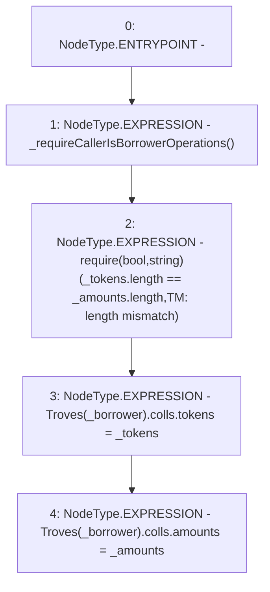

# Context: TroveManagerTester.updateTroveColl

**Contract:** `TroveManagerTester` (Inherits: TroveManager, ReentrancyGuard, ITroveManager, TroveManagerBase, CheckContract, Ownable, LiquityBase, YetiCustomBase, BaseMath, ILiquityBase)
**Signature:** `updateTroveColl(address,address[],uint256[])`
**Method Selector ID:** `0x4e9de635`
**Visibility:** `external`
**Environment-Free:** `No (reads EVM state context)`
**Modifiers:** None

### State Variables Interaction
- **Reads:** Troves
- **Writes:** Troves

### Assertion Checks & Business Requirements
- require/assert: `require(bool,string)(_tokens.length == _amounts.length,TM: length mismatch)`

### Environment & Verification Flags
- **Uses Foundry Cheatcodes:** No
- **Has Echidna Properties:** No

### Internal Calls Tree
- None

### External Calls / Value Transfers
- None

### Control Flow Graph (CFG)


### Source Mapping
Declared in: `certora-ac-datasets/detasets/web3bugs/dataset/web3bugs/66/packages/contracts/contracts/TroveManager.sol` on lines **933** to **938**

```solidity
    function updateTroveColl(address _borrower, address[] memory _tokens, uint[] memory _amounts) external override {
        _requireCallerIsBorrowerOperations();
        require(_tokens.length == _amounts.length, "TM: length mismatch");
        Troves[_borrower].colls.tokens = _tokens;
        Troves[_borrower].colls.amounts = _amounts;
    }

```
