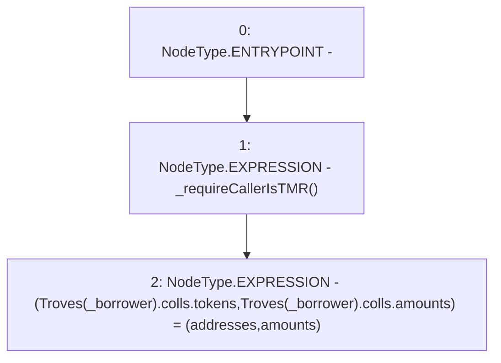

# Context: TroveManagerTester.updateTroveCollTMR

**Contract:** `TroveManagerTester` (Inherits: TroveManager, ReentrancyGuard, ITroveManager, TroveManagerBase, CheckContract, Ownable, LiquityBase, YetiCustomBase, BaseMath, ILiquityBase)
**Signature:** `updateTroveCollTMR(address,address[],uint256[])`
**Method Selector ID:** `0x1843bf88`
**Visibility:** `external`
**Environment-Free:** `No (reads EVM state context)`
**Modifiers:** None

### State Variables Interaction
- **Reads:** Troves
- **Writes:** Troves

### Environment & Verification Flags
- **Uses Foundry Cheatcodes:** No
- **Has Echidna Properties:** No

### Internal Calls Tree
- None

### External Calls / Value Transfers
- None

### Control Flow Graph (CFG)


### Source Mapping
Declared in: `certora-ac-datasets/detasets/web3bugs/dataset/web3bugs/66/packages/contracts/contracts/TroveManager.sol` on lines **909** to **912**

```solidity
    function updateTroveCollTMR(address  _borrower, address[] memory addresses, uint[] memory amounts) external override {
        _requireCallerIsTMR();
        (Troves[_borrower].colls.tokens, Troves[_borrower].colls.amounts) = (addresses, amounts);
    }

```
