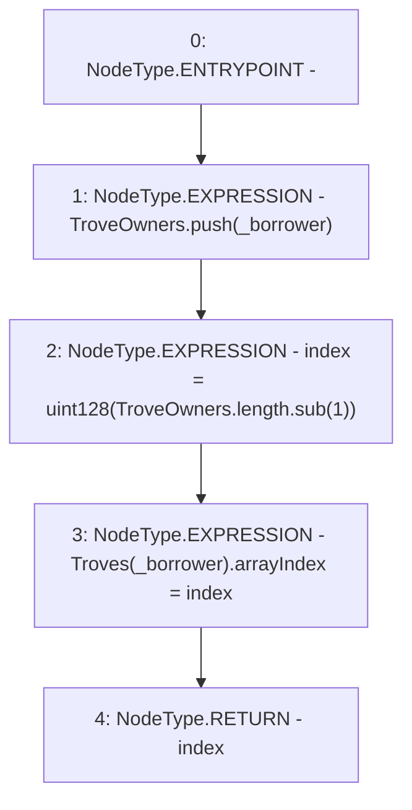

# Context: TroveManager._addTroveOwnerToArray

**Contract:** `TroveManager` (Inherits: ReentrancyGuard, ITroveManager, TroveManagerBase, CheckContract, Ownable, LiquityBase, YetiCustomBase, BaseMath, ILiquityBase)
**Signature:** `_addTroveOwnerToArray(address) returns (uint128)`
**Method Selector ID:** `Internal (No Method ID)`
**Visibility:** `internal`
**Environment-Free:** `Yes`
**Modifiers:** None

### State Variables Interaction
- **Reads:** TroveOwners, Troves
- **Writes:** TroveOwners, Troves

### Environment & Verification Flags
- **Uses Foundry Cheatcodes:** No
- **Has Echidna Properties:** No

### Internal Calls Tree
- None

### External Calls / Value Transfers
- `SafeMath.TMP_604(uint256) = LIBRARY_CALL, dest:SafeMath, function:SafeMath.sub(uint256,uint256), arguments:['REF_769', '1'] `

### Control Flow Graph (CFG)


### Source Mapping
Declared in: `certora-ac-datasets/detasets/web3bugs/dataset/web3bugs/66/packages/contracts/contracts/TroveManager.sol` on lines **656** to **665**

```solidity
    function _addTroveOwnerToArray(address _borrower) internal returns (uint128 index) {
        /* Max array size is 2**128 - 1, i.e. ~3e30 troves. No risk of overflow, since troves have minimum YUSD
        debt of liquidation reserve plus MIN_NET_DEBT. 3e30 YUSD dwarfs the value of all wealth in the world ( which is < 1e15 USD). */
        // Push the Troveowner to the array
        TroveOwners.push(_borrower);

        // Record the index of the new Troveowner on their Trove struct
        index = uint128(TroveOwners.length.sub(1));
        Troves[_borrower].arrayIndex = index;
    }

```
