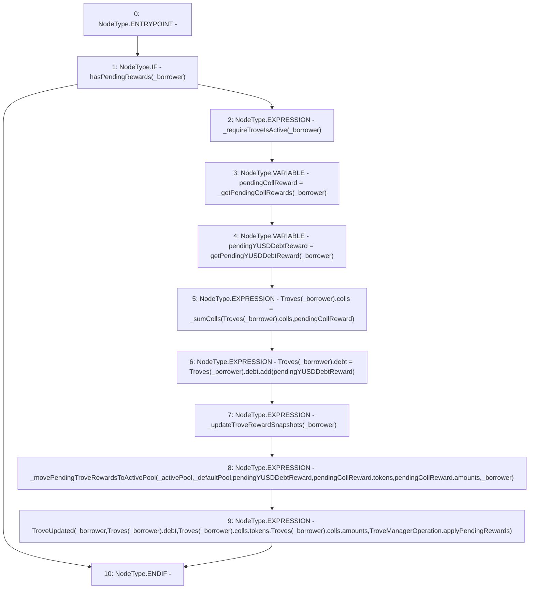

# Context: TroveManager._applyPendingRewards

**Contract:** `TroveManager` (Inherits: ReentrancyGuard, ITroveManager, TroveManagerBase, CheckContract, Ownable, LiquityBase, YetiCustomBase, BaseMath, ILiquityBase)
**Signature:** `_applyPendingRewards(IActivePool,IDefaultPool,address)`
**Method Selector ID:** `Internal (No Method ID)`
**Visibility:** `internal`
**Environment-Free:** `No (reads EVM state context)`
**Modifiers:** None

### State Variables Interaction
- **Reads:** Troves
- **Writes:** Troves

### Environment & Verification Flags
- **Uses Foundry Cheatcodes:** No
- **Has Echidna Properties:** No

### Internal Calls Tree
- None

### External Calls / Value Transfers
- `SafeMath.TMP_488(uint256) = LIBRARY_CALL, dest:SafeMath, function:SafeMath.add(uint256,uint256), arguments:['REF_565', 'pendingYUSDDebtReward'] `

### Control Flow Graph (CFG)


### Source Mapping
Declared in: `certora-ac-datasets/detasets/web3bugs/dataset/web3bugs/66/packages/contracts/contracts/TroveManager.sol` on lines **339** to **364**

```solidity
    function _applyPendingRewards(IActivePool _activePool, IDefaultPool _defaultPool, address _borrower) internal {
        if (hasPendingRewards(_borrower)) {
            _requireTroveIsActive(_borrower);

            // Compute pending collateral rewards
            newColls memory pendingCollReward = _getPendingCollRewards(_borrower);
            uint pendingYUSDDebtReward = getPendingYUSDDebtReward(_borrower);

            // Apply pending rewards to trove's state
            Troves[_borrower].colls = _sumColls(Troves[_borrower].colls, pendingCollReward);
            Troves[_borrower].debt = Troves[_borrower].debt.add(pendingYUSDDebtReward);

            _updateTroveRewardSnapshots(_borrower);

            // Transfer from DefaultPool to ActivePool
            _movePendingTroveRewardsToActivePool(_activePool, _defaultPool, pendingYUSDDebtReward, pendingCollReward.tokens, pendingCollReward.amounts, _borrower);

            emit TroveUpdated(
                _borrower,
                Troves[_borrower].debt,
                Troves[_borrower].colls.tokens,
                Troves[_borrower].colls.amounts,
                TroveManagerOperation.applyPendingRewards
            );
        }
    }

```
