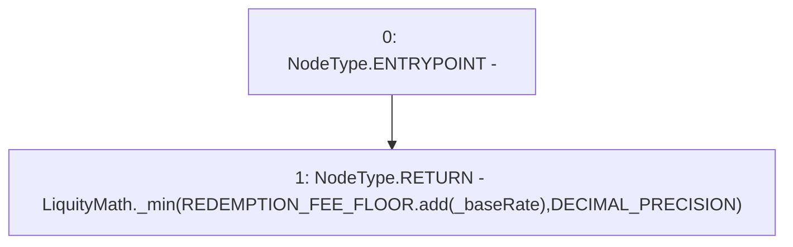

# Context: TroveManager._calcRedemptionRate

**Contract:** `TroveManager` (Inherits: ReentrancyGuard, ITroveManager, TroveManagerBase, CheckContract, Ownable, LiquityBase, YetiCustomBase, BaseMath, ILiquityBase)
**Signature:** `_calcRedemptionRate(uint256) returns (uint256)`
**Method Selector ID:** `Internal (No Method ID)`
**Visibility:** `internal`
**Environment-Free:** `Yes`
**Modifiers:** None

### State Variables Interaction
- **Reads:** DECIMAL_PRECISION, REDEMPTION_FEE_FLOOR
- **Writes:** None

### Environment & Verification Flags
- **Uses Foundry Cheatcodes:** No
- **Has Echidna Properties:** No

### Internal Calls Tree
- None

### External Calls / Value Transfers
- `SafeMath.TMP_626(uint256) = LIBRARY_CALL, dest:SafeMath, function:SafeMath.add(uint256,uint256), arguments:['REDEMPTION_FEE_FLOOR', '_baseRate'] `
- `LiquityMath.TMP_627(uint256) = LIBRARY_CALL, dest:LiquityMath, function:LiquityMath._min(uint256,uint256), arguments:['TMP_626', 'DECIMAL_PRECISION'] `

### Control Flow Graph (CFG)


### Source Mapping
Declared in: `certora-ac-datasets/detasets/web3bugs/dataset/web3bugs/66/packages/contracts/contracts/TroveManager.sol` on lines **720** to **725**

```solidity
    function _calcRedemptionRate(uint _baseRate) internal pure returns (uint) {
        return LiquityMath._min(
            REDEMPTION_FEE_FLOOR.add(_baseRate),
            DECIMAL_PRECISION // cap at a maximum of 100%
        );
    }

```
