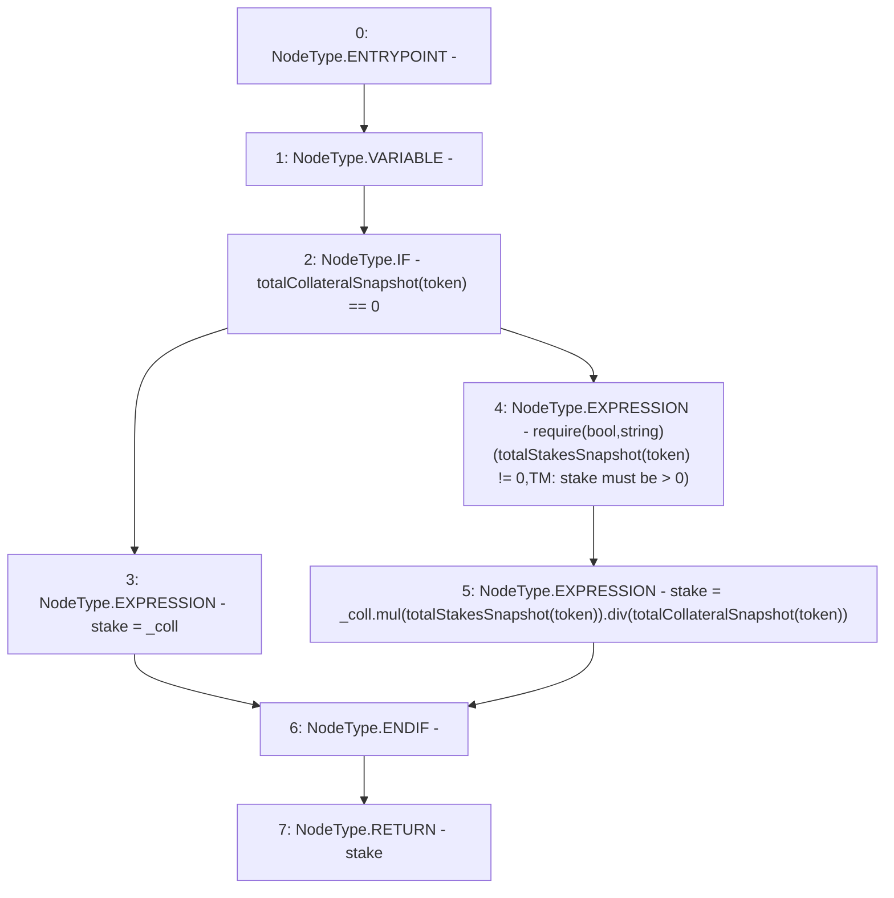

# Context: TroveManager._computeNewStake

**Contract:** `TroveManager` (Inherits: ReentrancyGuard, ITroveManager, TroveManagerBase, CheckContract, Ownable, LiquityBase, YetiCustomBase, BaseMath, ILiquityBase)
**Signature:** `_computeNewStake(address,uint256) returns (uint256)`
**Method Selector ID:** `Internal (No Method ID)`
**Visibility:** `internal`
**Environment-Free:** `Yes`
**Modifiers:** None

### State Variables Interaction
- **Reads:** totalCollateralSnapshot, totalStakesSnapshot
- **Writes:** None

### Assertion Checks & Business Requirements
- require/assert: `require(bool,string)(totalStakesSnapshot[token] != 0,TM: stake must be > 0)`

### Environment & Verification Flags
- **Uses Foundry Cheatcodes:** No
- **Has Echidna Properties:** No

### Internal Calls Tree
- None

### External Calls / Value Transfers
- `SafeMath.TMP_540(uint256) = LIBRARY_CALL, dest:SafeMath, function:SafeMath.div(uint256,uint256), arguments:['TMP_539', 'REF_696'] `
- `SafeMath.TMP_539(uint256) = LIBRARY_CALL, dest:SafeMath, function:SafeMath.mul(uint256,uint256), arguments:['_coll', 'REF_694'] `

### Control Flow Graph (CFG)


### Source Mapping
Declared in: `certora-ac-datasets/detasets/web3bugs/dataset/web3bugs/66/packages/contracts/contracts/TroveManager.sol` on lines **520** to **535**

```solidity
    function _computeNewStake(address token, uint _coll) internal view returns (uint) {
        uint stake;
        if (totalCollateralSnapshot[token] == 0) {
            stake = _coll;
        } else {
            /*
            * The following assert() holds true because:
            * - The system always contains >= 1 trove
            * - When we close or liquidate a trove, we redistribute the pending rewards, so if all troves were closed/liquidated,
            * rewards would’ve been emptied and totalCollateralSnapshot would be zero too.
            */
            require(totalStakesSnapshot[token] != 0, "TM: stake must be > 0");
            stake = _coll.mul(totalStakesSnapshot[token]).div(totalCollateralSnapshot[token]);
        }
        return stake;
    }

```
