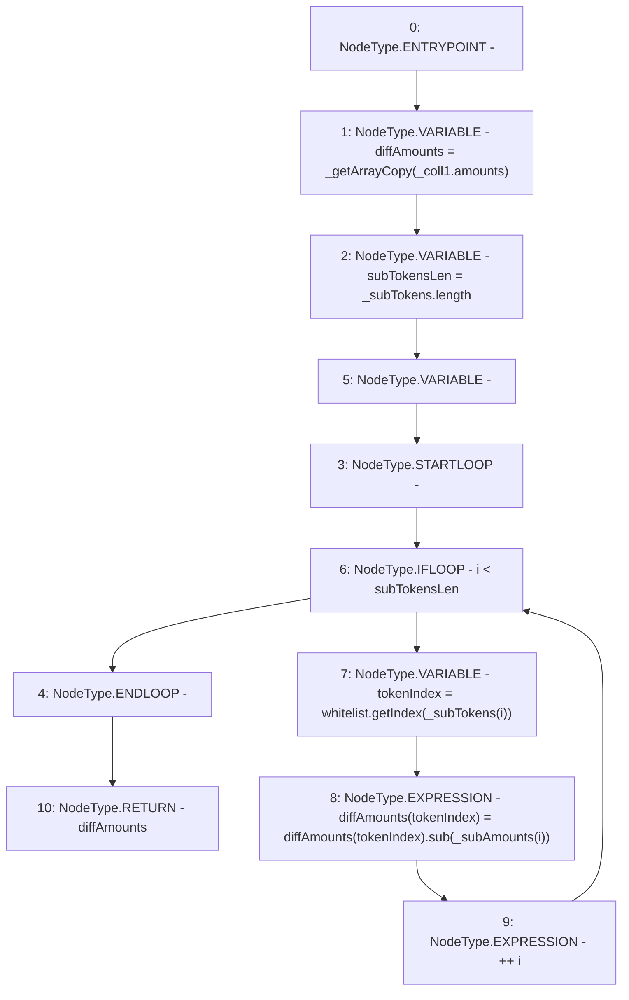

# Context: TroveManager._leftSubColls

**Contract:** `TroveManager` (Inherits: ReentrancyGuard, ITroveManager, TroveManagerBase, CheckContract, Ownable, LiquityBase, YetiCustomBase, BaseMath, ILiquityBase)
**Signature:** `_leftSubColls(YetiCustomBase.newColls,address[],uint256[]) returns (uint256[])`
**Method Selector ID:** `Internal (No Method ID)`
**Visibility:** `internal`
**Environment-Free:** `Yes`
**Modifiers:** None

### State Variables Interaction
- **Reads:** whitelist
- **Writes:** None

### Environment & Verification Flags
- **Uses Foundry Cheatcodes:** No
- **Has Echidna Properties:** No

### Internal Calls Tree
- None

### External Calls / Value Transfers
- `IWhitelist.TMP_398(uint256) = HIGH_LEVEL_CALL, dest:whitelist(IWhitelist), function:getIndex, arguments:['REF_486']  `
- `SafeMath.TMP_399(uint256) = LIBRARY_CALL, dest:SafeMath, function:SafeMath.sub(uint256,uint256), arguments:['REF_488', 'REF_490'] `

### Control Flow Graph (CFG)


### Source Mapping
Declared in: `certora-ac-datasets/detasets/web3bugs/dataset/web3bugs/66/packages/contracts/contracts/Dependencies/YetiCustomBase.sol` on lines **118** to **132**

```solidity
    function _leftSubColls(newColls memory _coll1, address[] memory _subTokens, uint[] memory _subAmounts)
        internal
        view
        returns (uint[] memory)
    {
        uint[] memory diffAmounts = _getArrayCopy(_coll1.amounts);

        //assumes that coll1.tokens = whitelist tokens. Keeps all of coll1's tokens, and subtracts coll2's amounts
        uint256 subTokensLen = _subTokens.length;
        for (uint256 i; i < subTokensLen; ++i) {
            uint256 tokenIndex = whitelist.getIndex(_subTokens[i]);
            diffAmounts[tokenIndex] = diffAmounts[tokenIndex].sub(_subAmounts[i]);
        }
        return diffAmounts;
    }

```
