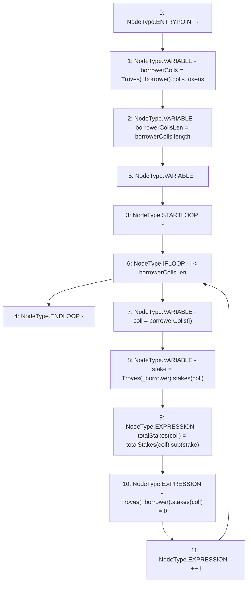

# Context: TroveManager._removeStake

**Contract:** `TroveManager` (Inherits: ReentrancyGuard, ITroveManager, TroveManagerBase, CheckContract, Ownable, LiquityBase, YetiCustomBase, BaseMath, ILiquityBase)
**Signature:** `_removeStake(address)`
**Method Selector ID:** `Internal (No Method ID)`
**Visibility:** `internal`
**Environment-Free:** `Yes`
**Modifiers:** None

### State Variables Interaction
- **Reads:** Troves, totalStakes
- **Writes:** Troves, totalStakes

### Environment & Verification Flags
- **Uses Foundry Cheatcodes:** No
- **Has Echidna Properties:** No

### Internal Calls Tree
- None

### External Calls / Value Transfers
- `SafeMath.TMP_528(uint256) = LIBRARY_CALL, dest:SafeMath, function:SafeMath.sub(uint256,uint256), arguments:['REF_663', 'stake'] `

### Control Flow Graph (CFG)


### Source Mapping
Declared in: `certora-ac-datasets/detasets/web3bugs/dataset/web3bugs/66/packages/contracts/contracts/TroveManager.sol` on lines **485** to **494**

```solidity
    function _removeStake(address _borrower) internal {
        address[] memory borrowerColls = Troves[_borrower].colls.tokens;
        uint256 borrowerCollsLen = borrowerColls.length;
        for (uint256 i; i < borrowerCollsLen; ++i) {
            address coll = borrowerColls[i];
            uint stake = Troves[_borrower].stakes[coll];
            totalStakes[coll] = totalStakes[coll].sub(stake);
            Troves[_borrower].stakes[coll] = 0;
        }
    }

```
