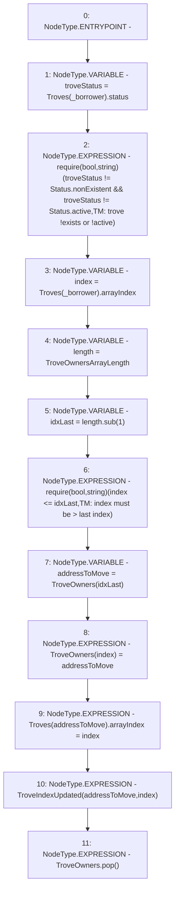

# Context: TroveManager._removeTroveOwner

**Contract:** `TroveManager` (Inherits: ReentrancyGuard, ITroveManager, TroveManagerBase, CheckContract, Ownable, LiquityBase, YetiCustomBase, BaseMath, ILiquityBase)
**Signature:** `_removeTroveOwner(address,uint256)`
**Method Selector ID:** `Internal (No Method ID)`
**Visibility:** `internal`
**Environment-Free:** `Yes`
**Modifiers:** None

### State Variables Interaction
- **Reads:** TroveOwners, Troves
- **Writes:** TroveOwners, Troves

### Assertion Checks & Business Requirements
- require/assert: `require(bool,string)(troveStatus != Status.nonExistent && troveStatus != Status.active,TM: trove !exists or !active)`
- require/assert: `require(bool,string)(index <= idxLast,TM: index must be > last index)`

### Environment & Verification Flags
- **Uses Foundry Cheatcodes:** No
- **Has Echidna Properties:** No

### Internal Calls Tree
- None

### External Calls / Value Transfers
- `SafeMath.TMP_610(uint256) = LIBRARY_CALL, dest:SafeMath, function:SafeMath.sub(uint256,uint256), arguments:['length', '1'] `

### Control Flow Graph (CFG)


### Source Mapping
Declared in: `certora-ac-datasets/detasets/web3bugs/dataset/web3bugs/66/packages/contracts/contracts/TroveManager.sol` on lines **671** to **689**

```solidity
    function _removeTroveOwner(address _borrower, uint TroveOwnersArrayLength) internal {
        Status troveStatus = Troves[_borrower].status;
        // It’s set in caller function `_closeTrove`
        require(troveStatus != Status.nonExistent && troveStatus != Status.active, "TM: trove !exists or !active");

        uint128 index = Troves[_borrower].arrayIndex;
        uint length = TroveOwnersArrayLength;
        uint idxLast = length.sub(1);

        require(index <= idxLast, "TM: index must be > last index");

        address addressToMove = TroveOwners[idxLast];

        TroveOwners[index] = addressToMove;
        Troves[addressToMove].arrayIndex = index;
        emit TroveIndexUpdated(addressToMove, index);

        TroveOwners.pop();
    }

```
