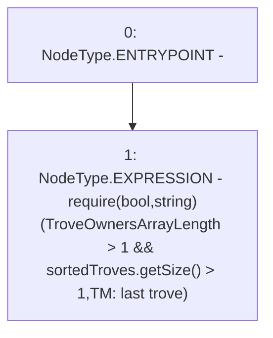

# Context: TroveManager._requireMoreThanOneTroveInSystem

**Contract:** `TroveManager` (Inherits: ReentrancyGuard, ITroveManager, TroveManagerBase, CheckContract, Ownable, LiquityBase, YetiCustomBase, BaseMath, ILiquityBase)
**Signature:** `_requireMoreThanOneTroveInSystem(uint256)`
**Method Selector ID:** `Internal (No Method ID)`
**Visibility:** `internal`
**Environment-Free:** `Yes`
**Modifiers:** None

### State Variables Interaction
- **Reads:** sortedTroves
- **Writes:** None

### Assertion Checks & Business Requirements
- require/assert: `require(bool,string)(TroveOwnersArrayLength > 1 && sortedTroves.getSize() > 1,TM: last trove)`

### Environment & Verification Flags
- **Uses Foundry Cheatcodes:** No
- **Has Echidna Properties:** No

### Internal Calls Tree
- None

### External Calls / Value Transfers
- `ISortedTroves.TMP_676(uint256) = HIGH_LEVEL_CALL, dest:sortedTroves(ISortedTroves), function:getSize, arguments:[]  `

### Control Flow Graph (CFG)


### Source Mapping
Declared in: `certora-ac-datasets/detasets/web3bugs/dataset/web3bugs/66/packages/contracts/contracts/TroveManager.sol` on lines **843** to **845**

```solidity
    function _requireMoreThanOneTroveInSystem(uint TroveOwnersArrayLength) internal view {
        require (TroveOwnersArrayLength > 1 && sortedTroves.getSize() > 1, "TM: last trove");
    }

```
