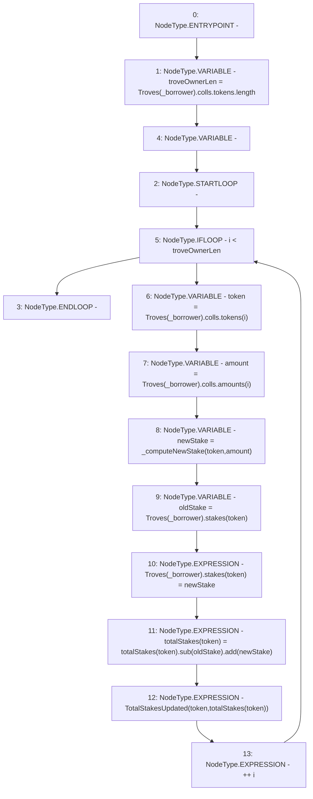

# Context: TroveManager._updateStakeAndTotalStakes

**Contract:** `TroveManager` (Inherits: ReentrancyGuard, ITroveManager, TroveManagerBase, CheckContract, Ownable, LiquityBase, YetiCustomBase, BaseMath, ILiquityBase)
**Signature:** `_updateStakeAndTotalStakes(address)`
**Method Selector ID:** `Internal (No Method ID)`
**Visibility:** `internal`
**Environment-Free:** `Yes`
**Modifiers:** None

### State Variables Interaction
- **Reads:** Troves, totalStakes
- **Writes:** Troves, totalStakes

### Environment & Verification Flags
- **Uses Foundry Cheatcodes:** No
- **Has Echidna Properties:** No

### Internal Calls Tree
- None

### External Calls / Value Transfers
- `SafeMath.TMP_534(uint256) = LIBRARY_CALL, dest:SafeMath, function:SafeMath.add(uint256,uint256), arguments:['TMP_533', 'newStake'] `
- `SafeMath.TMP_533(uint256) = LIBRARY_CALL, dest:SafeMath, function:SafeMath.sub(uint256,uint256), arguments:['REF_687', 'oldStake'] `

### Control Flow Graph (CFG)


### Source Mapping
Declared in: `certora-ac-datasets/detasets/web3bugs/dataset/web3bugs/66/packages/contracts/contracts/TroveManager.sol` on lines **503** to **517**

```solidity
    function _updateStakeAndTotalStakes(address _borrower) internal {
        uint256 troveOwnerLen = Troves[_borrower].colls.tokens.length;
        for (uint256 i; i < troveOwnerLen; ++i) {
            address token = Troves[_borrower].colls.tokens[i];
            uint amount = Troves[_borrower].colls.amounts[i];

            uint newStake = _computeNewStake(token, amount);
            uint oldStake = Troves[_borrower].stakes[token];

            Troves[_borrower].stakes[token] = newStake;
            totalStakes[token] = totalStakes[token].sub(oldStake).add(newStake);

            emit TotalStakesUpdated(token, totalStakes[token]);
        }
    }

```
