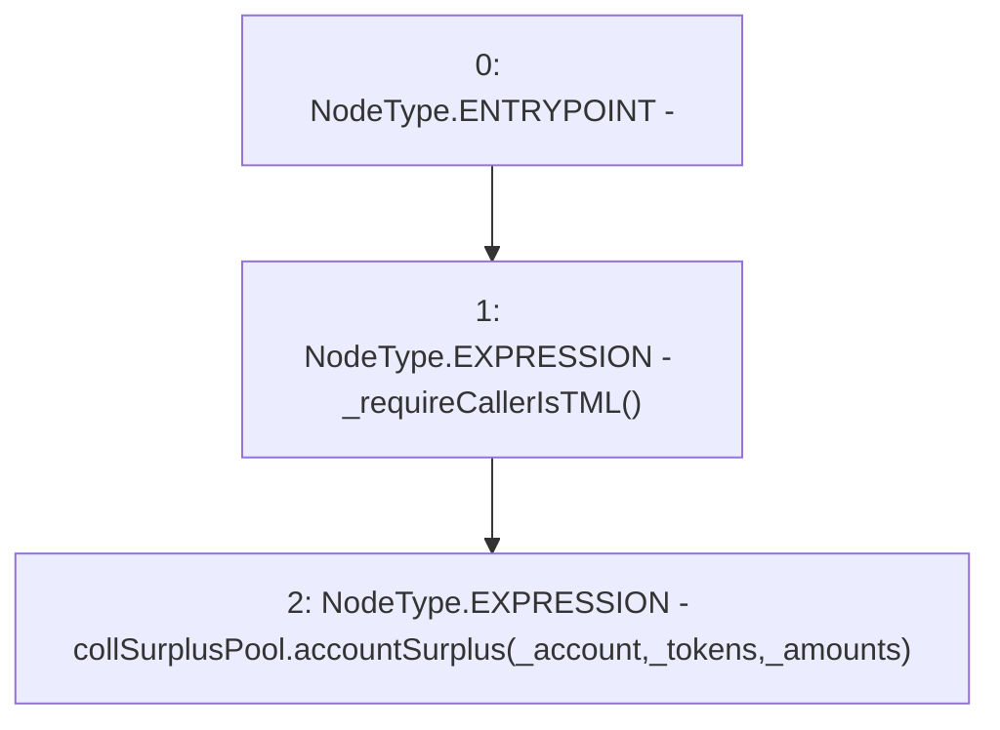

# Context: TroveManager.collSurplusUpdate

**Contract:** `TroveManager` (Inherits: ReentrancyGuard, ITroveManager, TroveManagerBase, CheckContract, Ownable, LiquityBase, YetiCustomBase, BaseMath, ILiquityBase)
**Signature:** `collSurplusUpdate(address,address[],uint256[])`
**Method Selector ID:** `0x96755e55`
**Visibility:** `external`
**Environment-Free:** `No (reads EVM state context)`
**Modifiers:** None

### State Variables Interaction
- **Reads:** collSurplusPool
- **Writes:** None

### Environment & Verification Flags
- **Uses Foundry Cheatcodes:** No
- **Has Echidna Properties:** No

### Internal Calls Tree
- None

### External Calls / Value Transfers
- `ICollSurplusPool.HIGH_LEVEL_CALL, dest:collSurplusPool(ICollSurplusPool), function:accountSurplus, arguments:['_account', '_tokens', '_amounts']  `

### Control Flow Graph (CFG)


### Source Mapping
Declared in: `certora-ac-datasets/detasets/web3bugs/dataset/web3bugs/66/packages/contracts/contracts/TroveManager.sol` on lines **224** to **227**

```solidity
    function collSurplusUpdate(address _account, address[] memory _tokens, uint[] memory _amounts) external override {
        _requireCallerIsTML();
        collSurplusPool.accountSurplus(_account, _tokens, _amounts);
    }

```
