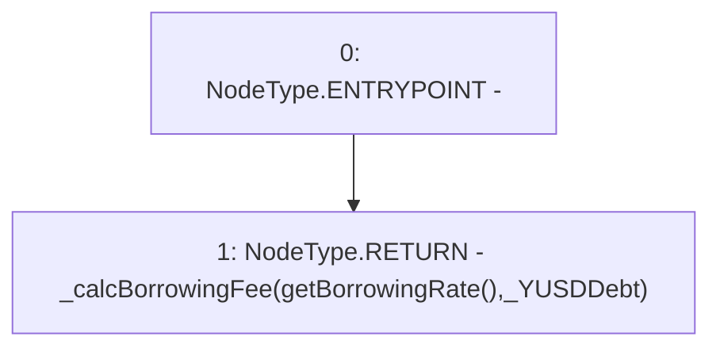

# Context: TroveManager.getBorrowingFee

**Contract:** `TroveManager` (Inherits: ReentrancyGuard, ITroveManager, TroveManagerBase, CheckContract, Ownable, LiquityBase, YetiCustomBase, BaseMath, ILiquityBase)
**Signature:** `getBorrowingFee(uint256) returns (uint256)`
**Method Selector ID:** `0x631203b0`
**Visibility:** `external`
**Environment-Free:** `Yes`
**Modifiers:** None

### State Variables Interaction
- **Reads:** None
- **Writes:** None

### Environment & Verification Flags
- **Uses Foundry Cheatcodes:** No
- **Has Echidna Properties:** No

### Internal Calls Tree
- None

### External Calls / Value Transfers
- None

### Control Flow Graph (CFG)


### Source Mapping
Declared in: `certora-ac-datasets/detasets/web3bugs/dataset/web3bugs/66/packages/contracts/contracts/TroveManager.sol` on lines **759** to **761**

```solidity
    function getBorrowingFee(uint _YUSDDebt) external view override returns (uint) {
        return _calcBorrowingFee(getBorrowingRate(), _YUSDDebt);
    }

```
