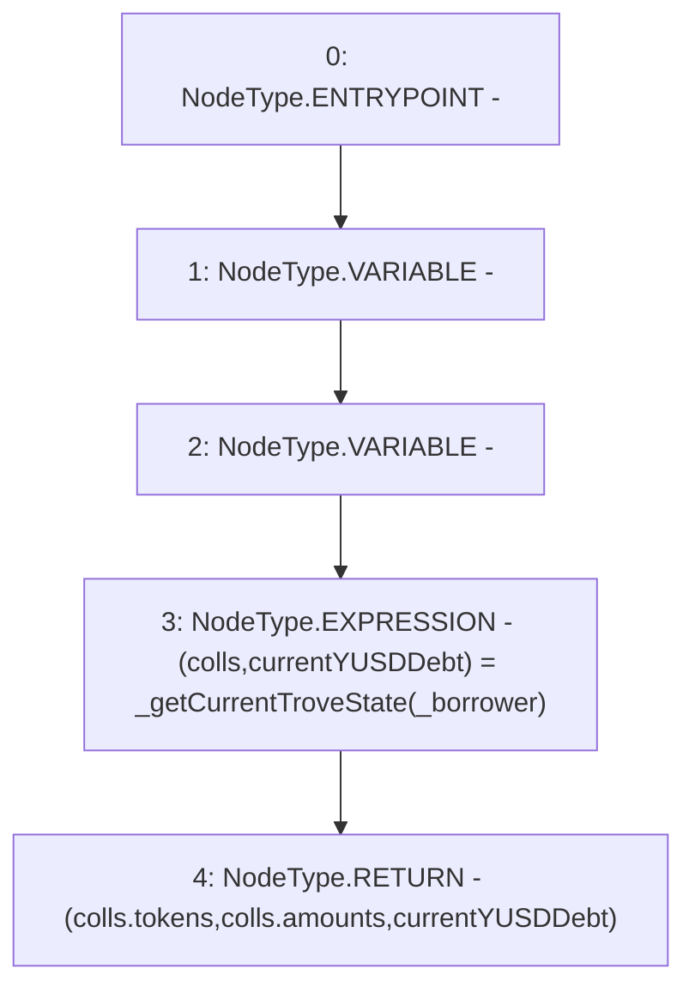

# Context: TroveManager.getCurrentTroveState

**Contract:** `TroveManager` (Inherits: ReentrancyGuard, ITroveManager, TroveManagerBase, CheckContract, Ownable, LiquityBase, YetiCustomBase, BaseMath, ILiquityBase)
**Signature:** `getCurrentTroveState(address) returns (address[], uint256[], uint256)`
**Method Selector ID:** `0x35a058b4`
**Visibility:** `external`
**Environment-Free:** `Yes`
**Modifiers:** None

### State Variables Interaction
- **Reads:** None
- **Writes:** None

### Environment & Verification Flags
- **Uses Foundry Cheatcodes:** No
- **Has Echidna Properties:** No

### Internal Calls Tree
- None

### External Calls / Value Transfers
- None

### Control Flow Graph (CFG)


### Source Mapping
Declared in: `certora-ac-datasets/detasets/web3bugs/dataset/web3bugs/66/packages/contracts/contracts/TroveManager.sol` on lines **896** to **899**

```solidity
    function getCurrentTroveState(address _borrower) external override view returns (address[] memory, uint[] memory, uint) {
        (newColls memory colls, uint currentYUSDDebt) = _getCurrentTroveState(_borrower);
        return (colls.tokens, colls.amounts, currentYUSDDebt);
    }

```
