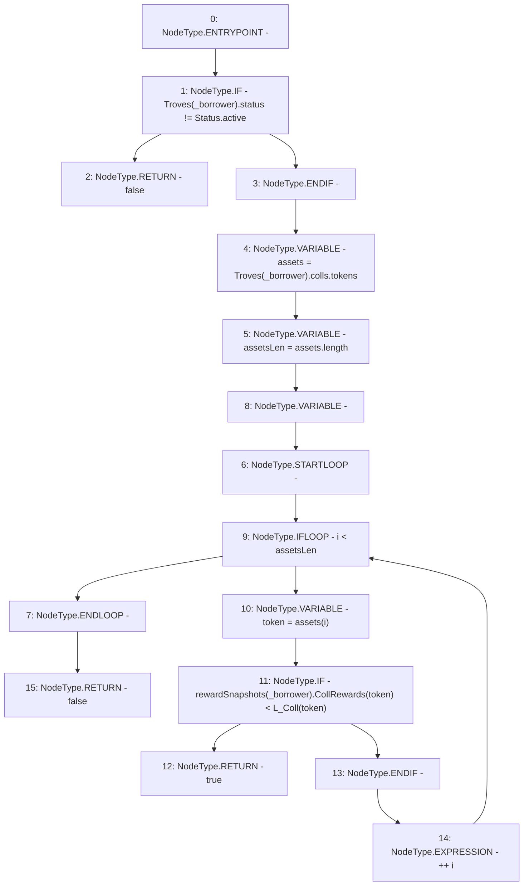

# Context: TroveManager.hasPendingRewards

**Contract:** `TroveManager` (Inherits: ReentrancyGuard, ITroveManager, TroveManagerBase, CheckContract, Ownable, LiquityBase, YetiCustomBase, BaseMath, ILiquityBase)
**Signature:** `hasPendingRewards(address) returns (bool)`
**Method Selector ID:** `0xe2ac77b0`
**Visibility:** `public`
**Environment-Free:** `Yes`
**Modifiers:** None

### State Variables Interaction
- **Reads:** L_Coll, Troves, rewardSnapshots
- **Writes:** None

### Environment & Verification Flags
- **Uses Foundry Cheatcodes:** No
- **Has Echidna Properties:** No

### Internal Calls Tree
- None

### External Calls / Value Transfers
- None

### Control Flow Graph (CFG)


### Source Mapping
Declared in: `certora-ac-datasets/detasets/web3bugs/dataset/web3bugs/66/packages/contracts/contracts/TroveManager.sol` on lines **438** to **454**

```solidity
    function hasPendingRewards(address _borrower) public view override returns (bool) {
        /*
        * A Trove has pending rewards if its snapshot is less than the current rewards per-unit-staked sum:
        * this indicates that rewards have occured since the snapshot was made, and the user therefore has
        * pending rewards
        */
        if (Troves[_borrower].status != Status.active) {return false;}
        address[] memory assets =  Troves[_borrower].colls.tokens;
        uint256 assetsLen = assets.length;
        for (uint256 i; i < assetsLen; ++i) {
            address token = assets[i];
            if (rewardSnapshots[_borrower].CollRewards[token] < L_Coll[token]) {
                return true;
            }
        }
        return false;
    }

```
