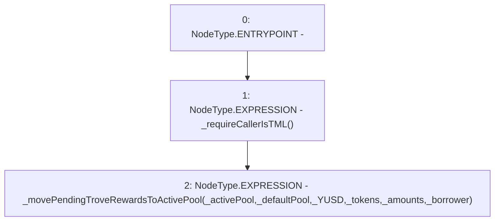

# Context: TroveManager.movePendingTroveRewardsToActivePool

**Contract:** `TroveManager` (Inherits: ReentrancyGuard, ITroveManager, TroveManagerBase, CheckContract, Ownable, LiquityBase, YetiCustomBase, BaseMath, ILiquityBase)
**Signature:** `movePendingTroveRewardsToActivePool(IActivePool,IDefaultPool,uint256,address[],uint256[],address)`
**Method Selector ID:** `0x7837eeeb`
**Visibility:** `external`
**Environment-Free:** `No (reads EVM state context)`
**Modifiers:** None

### State Variables Interaction
- **Reads:** None
- **Writes:** None

### Environment & Verification Flags
- **Uses Foundry Cheatcodes:** No
- **Has Echidna Properties:** No

### Internal Calls Tree
- None

### External Calls / Value Transfers
- None

### Control Flow Graph (CFG)


### Source Mapping
Declared in: `certora-ac-datasets/detasets/web3bugs/dataset/web3bugs/66/packages/contracts/contracts/TroveManager.sol` on lines **230** to **233**

```solidity
    function movePendingTroveRewardsToActivePool(IActivePool _activePool, IDefaultPool _defaultPool, uint _YUSD, address[] memory _tokens, uint[] memory _amounts, address _borrower) external override {
        _requireCallerIsTML();
        _movePendingTroveRewardsToActivePool(_activePool, _defaultPool, _YUSD, _tokens, _amounts, _borrower);
    }

```
