# Context: TroveManager.redistributeDebtAndColl

**Contract:** `TroveManager` (Inherits: ReentrancyGuard, ITroveManager, TroveManagerBase, CheckContract, Ownable, LiquityBase, YetiCustomBase, BaseMath, ILiquityBase)
**Signature:** `redistributeDebtAndColl(IActivePool,IDefaultPool,uint256,address[],uint256[])`
**Method Selector ID:** `0xe34f6d44`
**Visibility:** `external`
**Environment-Free:** `No (reads EVM state context)`
**Modifiers:** None

### State Variables Interaction
- **Reads:** DECIMAL_PRECISION, L_Coll, L_YUSDDebt, lastCollError_Redistribution, lastYUSDDebtError_Redistribution, totalStakes, whitelist
- **Writes:** L_Coll, L_YUSDDebt, lastCollError_Redistribution, lastYUSDDebtError_Redistribution

### Assertion Checks & Business Requirements
- require/assert: `require(bool,string)(tokensLen == _amounts.length,TM: len tokens amounts)`

### Environment & Verification Flags
- **Uses Foundry Cheatcodes:** No
- **Has Echidna Properties:** No

### Internal Calls Tree
- None

### External Calls / Value Transfers
- `SafeMath.TMP_555(uint256) = LIBRARY_CALL, dest:SafeMath, function:SafeMath.mul(uint256,uint256), arguments:['proratedDebtForCollateral', 'DECIMAL_PRECISION'] `
- `IWhitelist.TMP_547(uint256) = HIGH_LEVEL_CALL, dest:whitelist(IWhitelist), function:getValueVC, arguments:['token', 'amount']  `
- `IActivePool.TMP_576(bool) = HIGH_LEVEL_CALL, dest:_activePool(IActivePool), function:sendCollaterals, arguments:['TMP_575', '_tokens', '_amounts']  `
- `IDefaultPool.HIGH_LEVEL_CALL, dest:_defaultPool(IDefaultPool), function:increaseYUSDDebt, arguments:['_debt']  `
- `IActivePool.HIGH_LEVEL_CALL, dest:_activePool(IActivePool), function:decreaseYUSDDebt, arguments:['_debt']  `
- `SafeMath.TMP_548(uint256) = LIBRARY_CALL, dest:SafeMath, function:SafeMath.mul(uint256,uint256), arguments:['collateralVC', '_debt'] `
- `SafeMath.TMP_570(uint256) = LIBRARY_CALL, dest:SafeMath, function:SafeMath.add(uint256,uint256), arguments:['REF_724', 'CollRewardPerUnitStaked'] `
- `SafeMath.TMP_553(uint256) = LIBRARY_CALL, dest:SafeMath, function:SafeMath.mul(uint256,uint256), arguments:['amount', 'TMP_552'] `
- `SafeMath.TMP_571(uint256) = LIBRARY_CALL, dest:SafeMath, function:SafeMath.add(uint256,uint256), arguments:['REF_727', 'YUSDDebtRewardPerUnitStaked'] `
- `SafeMath.TMP_562(uint256) = LIBRARY_CALL, dest:SafeMath, function:SafeMath.div(uint256,uint256), arguments:['YUSDDebtNumerator', 'TMP_561'] `
- `SafeMath.TMP_554(uint256) = LIBRARY_CALL, dest:SafeMath, function:SafeMath.add(uint256,uint256), arguments:['TMP_553', 'REF_707'] `
- `SafeMath.TMP_563(uint256) = LIBRARY_CALL, dest:SafeMath, function:SafeMath.mul(uint256,uint256), arguments:['CollRewardPerUnitStaked', 'thisTotalStakes'] `
- `SafeMath.TMP_561(uint256) = LIBRARY_CALL, dest:SafeMath, function:SafeMath.mul(uint256,uint256), arguments:['thisTotalStakes', 'TMP_560'] `
- `SafeMath.TMP_568(uint256) = LIBRARY_CALL, dest:SafeMath, function:SafeMath.mul(uint256,uint256), arguments:['YUSDDebtRewardPerUnitStaked', 'TMP_567'] `
- `SafeMath.TMP_569(uint256) = LIBRARY_CALL, dest:SafeMath, function:SafeMath.sub(uint256,uint256), arguments:['YUSDDebtNumerator', 'TMP_568'] `
- `SafeMath.TMP_564(uint256) = LIBRARY_CALL, dest:SafeMath, function:SafeMath.sub(uint256,uint256), arguments:['CollNumerator', 'TMP_563'] `
- `IERC20.TMP_551(uint8) = HIGH_LEVEL_CALL, dest:TMP_550(IERC20), function:decimals, arguments:[]  `
- `SafeMath.TMP_558(uint256) = LIBRARY_CALL, dest:SafeMath, function:SafeMath.div(uint256,uint256), arguments:['CollNumerator', 'thisTotalStakes'] `
- `SafeMath.TMP_567(uint256) = LIBRARY_CALL, dest:SafeMath, function:SafeMath.mul(uint256,uint256), arguments:['thisTotalStakes', 'TMP_566'] `
- `SafeMath.TMP_549(uint256) = LIBRARY_CALL, dest:SafeMath, function:SafeMath.div(uint256,uint256), arguments:['TMP_548', 'totalCollateralVC'] `
- `SafeMath.TMP_556(uint256) = LIBRARY_CALL, dest:SafeMath, function:SafeMath.add(uint256,uint256), arguments:['TMP_555', 'REF_710'] `

### Control Flow Graph (CFG)

```mermaid
flowchart TD
    Node_0["0: NodeType.ENTRYPOINT - "]
    Node_0 --> Node_1
    Node_1["1: NodeType.EXPRESSION - _requireCallerIsTML()"]
    Node_1 --> Node_2
    Node_2["2: NodeType.VARIABLE - tokensLen = _tokens.length"]
    Node_2 --> Node_3
    Node_3["3: NodeType.EXPRESSION - require(bool,string)(tokensLen == _amounts.length,TM: len tokens amounts)"]
    Node_3 --> Node_4
    Node_4["4: NodeType.IF - _debt == 0"]
    Node_4 --> Node_5
    Node_4 --> Node_6
    Node_5["5: NodeType.RETURN - "]
    Node_6["6: NodeType.ENDIF - "]
    Node_6 --> Node_7
    Node_7["7: NodeType.VARIABLE - totalCollateralVC = _getVC(_tokens,_amounts)"]
    Node_7 --> Node_10
    Node_8["8: NodeType.STARTLOOP - "]
    Node_8 --> Node_11
    Node_9["9: NodeType.ENDLOOP - "]
    Node_9 --> Node_30
    Node_10["10: NodeType.VARIABLE - "]
    Node_10 --> Node_8
    Node_11["11: NodeType.IFLOOP - i < tokensLen"]
    Node_11 --> Node_12
    Node_11 --> Node_9
    Node_12["12: NodeType.VARIABLE - token = _tokens(i)"]
    Node_12 --> Node_13
    Node_13["13: NodeType.VARIABLE - amount = _amounts(i)"]
    Node_13 --> Node_14
    Node_14["14: NodeType.VARIABLE - collateralVC = whitelist.getValueVC(token,amount)"]
    Node_14 --> Node_15
    Node_15["15: NodeType.VARIABLE - proratedDebtForCollateral = collateralVC.mul(_debt).div(totalCollateralVC)"]
    Node_15 --> Node_16
    Node_16["16: NodeType.VARIABLE - dec = IERC20(token).decimals()"]
    Node_16 --> Node_17
    Node_17["17: NodeType.VARIABLE - CollNumerator = amount.mul(10 ** dec).add(lastCollError_Redistribution(token))"]
    Node_17 --> Node_18
    Node_18["18: NodeType.VARIABLE - YUSDDebtNumerator = proratedDebtForCollateral.mul(DECIMAL_PRECISION).add(lastYUSDDebtError_Redistribution(token))"]
    Node_18 --> Node_19
    Node_19["19: NodeType.IF - totalStakes(token) != 0"]
    Node_19 --> Node_20
    Node_19 --> Node_28
    Node_20["20: NodeType.VARIABLE - thisTotalStakes = totalStakes(token)"]
    Node_20 --> Node_21
    Node_21["21: NodeType.VARIABLE - CollRewardPerUnitStaked = CollNumerator.div(thisTotalStakes)"]
    Node_21 --> Node_22
    Node_22["22: NodeType.VARIABLE - YUSDDebtRewardPerUnitStaked = YUSDDebtNumerator.div(thisTotalStakes.mul(10 ** (18 - dec)))"]
    Node_22 --> Node_23
    Node_23["23: NodeType.EXPRESSION - lastCollError_Redistribution(token) = CollNumerator.sub(CollRewardPerUnitStaked.mul(thisTotalStakes))"]
    Node_23 --> Node_24
    Node_24["24: NodeType.EXPRESSION - lastYUSDDebtError_Redistribution(token) = YUSDDebtNumerator.sub(YUSDDebtRewardPerUnitStaked.mul(thisTotalStakes.mul(10 ** (18 - dec))))"]
    Node_24 --> Node_25
    Node_25["25: NodeType.EXPRESSION - L_Coll(token) = L_Coll(token).add(CollRewardPerUnitStaked)"]
    Node_25 --> Node_26
    Node_26["26: NodeType.EXPRESSION - L_YUSDDebt(token) = L_YUSDDebt(token).add(YUSDDebtRewardPerUnitStaked)"]
    Node_26 --> Node_27
    Node_27["27: NodeType.EXPRESSION - LTermsUpdated(token,L_Coll(token),L_YUSDDebt(token))"]
    Node_27 --> Node_28
    Node_28["28: NodeType.ENDIF - "]
    Node_28 --> Node_29
    Node_29["29: NodeType.EXPRESSION - ++ i"]
    Node_29 --> Node_11
    Node_30["30: NodeType.EXPRESSION - _activePool.decreaseYUSDDebt(_debt)"]
    Node_30 --> Node_31
    Node_31["31: NodeType.EXPRESSION - _defaultPool.increaseYUSDDebt(_debt)"]
    Node_31 --> Node_32
    Node_32["32: NodeType.EXPRESSION - _activePool.sendCollaterals(address(_defaultPool),_tokens,_amounts)"]
```


### Source Mapping
Declared in: `certora-ac-datasets/detasets/web3bugs/dataset/web3bugs/66/packages/contracts/contracts/TroveManager.sol` on lines **537** to **584**

```solidity
    function redistributeDebtAndColl(IActivePool _activePool, IDefaultPool _defaultPool, uint _debt, address[] memory _tokens, uint[] memory _amounts) external override {
        _requireCallerIsTML();
        uint256 tokensLen = _tokens.length;
        require(tokensLen == _amounts.length, "TM: len tokens amounts");
        if (_debt == 0) { return; }
        /*
        * Add distributed coll and debt rewards-per-unit-staked to the running totals. Division uses a "feedback"
        * error correction, to keep the cumulative error low in the running totals L_Coll and L_YUSDDebt:
        *
        * 1) Form numerators which compensate for the floor division errors that occurred the last time this
        * function was called.
        * 2) Calculate "per-unit-staked" ratios.
        * 3) Multiply each ratio back by its denominator, to reveal the current floor division error.
        * 4) Store these errors for use in the next correction when this function is called.
        * 5) Note: static analysis tools complain about this "division before multiplication", however, it is intended.
        */
        uint totalCollateralVC = _getVC(_tokens, _amounts); // total collateral value in VC terms

        for (uint256 i; i < tokensLen; ++i) {
            address token = _tokens[i];
            uint amount = _amounts[i];
            // Prorate debt per collateral by dividing each collateral value by cumulative collateral value and multiply by outstanding debt
            uint collateralVC = whitelist.getValueVC(token, amount);
            uint proratedDebtForCollateral = collateralVC.mul(_debt).div(totalCollateralVC);
            uint dec = IERC20(token).decimals();
            uint CollNumerator = amount.mul(10 ** dec).add(lastCollError_Redistribution[token]);
            uint YUSDDebtNumerator = proratedDebtForCollateral.mul(DECIMAL_PRECISION).add(lastYUSDDebtError_Redistribution[token]);
            if (totalStakes[token] != 0) {
                // Get the per-unit-staked terms
                uint256 thisTotalStakes = totalStakes[token];
                uint CollRewardPerUnitStaked = CollNumerator.div(thisTotalStakes);
                uint YUSDDebtRewardPerUnitStaked = YUSDDebtNumerator.div(thisTotalStakes.mul(10 ** (18 - dec)));

                lastCollError_Redistribution[token] = CollNumerator.sub(CollRewardPerUnitStaked.mul(thisTotalStakes));
                lastYUSDDebtError_Redistribution[token] = YUSDDebtNumerator.sub(YUSDDebtRewardPerUnitStaked.mul(thisTotalStakes.mul(10 ** (18 - dec))));

                // Add per-unit-staked terms to the running totals
                L_Coll[token] = L_Coll[token].add(CollRewardPerUnitStaked);
                L_YUSDDebt[token] = L_YUSDDebt[token].add(YUSDDebtRewardPerUnitStaked);
                emit LTermsUpdated(token, L_Coll[token], L_YUSDDebt[token]);
            }
        }

        // Transfer coll and debt from ActivePool to DefaultPool
        _activePool.decreaseYUSDDebt(_debt);
        _defaultPool.increaseYUSDDebt(_debt);
        _activePool.sendCollaterals(address(_defaultPool), _tokens, _amounts);
    }

```
