# Context: TroveManager.setAddresses

**Contract:** `TroveManager` (Inherits: ReentrancyGuard, ITroveManager, TroveManagerBase, CheckContract, Ownable, LiquityBase, YetiCustomBase, BaseMath, ILiquityBase)
**Signature:** `setAddresses(address,address,address,address,address,address,address,address,address,address,address,address,address)`
**Method Selector ID:** `0xdb5e7321`
**Visibility:** `external`
**Environment-Free:** `No (reads EVM state context)`
**Modifiers:**
- `onlyOwner`
  ```solidity
  modifier onlyOwner() {
          require(isOwner(), "CallerNotOwner");
          _;
      }
  ```

### State Variables Interaction
- **Reads:** None
- **Writes:** activePool, borrowerOperationsAddress, collSurplusPool, defaultPool, gasPoolAddress, sYETIContract, sortedTroves, stabilityPoolContract, troveManagerLiquidations, troveManagerLiquidationsAddress, troveManagerRedemptions, troveManagerRedemptionsAddress, whitelist, yetiTokenContract, yusdTokenContract

### Environment & Verification Flags
- **Uses Foundry Cheatcodes:** No
- **Has Echidna Properties:** No

### Internal Calls Tree
- None

### External Calls / Value Transfers
- None

### Control Flow Graph (CFG)

```mermaid
flowchart TD
    Node_0["0: NodeType.ENTRYPOINT - "]
    Node_0 --> Node_30
    Node_1["1: NodeType.EXPRESSION - checkContract(_borrowerOperationsAddress)"]
    Node_1 --> Node_2
    Node_2["2: NodeType.EXPRESSION - checkContract(_activePoolAddress)"]
    Node_2 --> Node_3
    Node_3["3: NodeType.EXPRESSION - checkContract(_defaultPoolAddress)"]
    Node_3 --> Node_4
    Node_4["4: NodeType.EXPRESSION - checkContract(_stabilityPoolAddress)"]
    Node_4 --> Node_5
    Node_5["5: NodeType.EXPRESSION - checkContract(_gasPoolAddress)"]
    Node_5 --> Node_6
    Node_6["6: NodeType.EXPRESSION - checkContract(_collSurplusPoolAddress)"]
    Node_6 --> Node_7
    Node_7["7: NodeType.EXPRESSION - checkContract(_yusdTokenAddress)"]
    Node_7 --> Node_8
    Node_8["8: NodeType.EXPRESSION - checkContract(_sortedTrovesAddress)"]
    Node_8 --> Node_9
    Node_9["9: NodeType.EXPRESSION - checkContract(_yetiTokenAddress)"]
    Node_9 --> Node_10
    Node_10["10: NodeType.EXPRESSION - checkContract(_sYETIAddress)"]
    Node_10 --> Node_11
    Node_11["11: NodeType.EXPRESSION - checkContract(_whitelistAddress)"]
    Node_11 --> Node_12
    Node_12["12: NodeType.EXPRESSION - checkContract(_troveManagerRedemptionsAddress)"]
    Node_12 --> Node_13
    Node_13["13: NodeType.EXPRESSION - checkContract(_troveManagerLiquidationsAddress)"]
    Node_13 --> Node_14
    Node_14["14: NodeType.EXPRESSION - borrowerOperationsAddress = _borrowerOperationsAddress"]
    Node_14 --> Node_15
    Node_15["15: NodeType.EXPRESSION - activePool = IActivePool(_activePoolAddress)"]
    Node_15 --> Node_16
    Node_16["16: NodeType.EXPRESSION - defaultPool = IDefaultPool(_defaultPoolAddress)"]
    Node_16 --> Node_17
    Node_17["17: NodeType.EXPRESSION - stabilityPoolContract = IStabilityPool(_stabilityPoolAddress)"]
    Node_17 --> Node_18
    Node_18["18: NodeType.EXPRESSION - whitelist = IWhitelist(_whitelistAddress)"]
    Node_18 --> Node_19
    Node_19["19: NodeType.EXPRESSION - gasPoolAddress = _gasPoolAddress"]
    Node_19 --> Node_20
    Node_20["20: NodeType.EXPRESSION - collSurplusPool = ICollSurplusPool(_collSurplusPoolAddress)"]
    Node_20 --> Node_21
    Node_21["21: NodeType.EXPRESSION - yusdTokenContract = IYUSDToken(_yusdTokenAddress)"]
    Node_21 --> Node_22
    Node_22["22: NodeType.EXPRESSION - sortedTroves = ISortedTroves(_sortedTrovesAddress)"]
    Node_22 --> Node_23
    Node_23["23: NodeType.EXPRESSION - yetiTokenContract = IYETIToken(_yetiTokenAddress)"]
    Node_23 --> Node_24
    Node_24["24: NodeType.EXPRESSION - sYETIContract = ISYETI(_sYETIAddress)"]
    Node_24 --> Node_25
    Node_25["25: NodeType.EXPRESSION - troveManagerRedemptionsAddress = _troveManagerRedemptionsAddress"]
    Node_25 --> Node_26
    Node_26["26: NodeType.EXPRESSION - troveManagerLiquidationsAddress = _troveManagerLiquidationsAddress"]
    Node_26 --> Node_27
    Node_27["27: NodeType.EXPRESSION - troveManagerRedemptions = ITroveManagerRedemptions(_troveManagerRedemptionsAddress)"]
    Node_27 --> Node_28
    Node_28["28: NodeType.EXPRESSION - troveManagerLiquidations = ITroveManagerLiquidations(_troveManagerLiquidationsAddress)"]
    Node_28 --> Node_29
    Node_29["29: NodeType.EXPRESSION - _renounceOwnership()"]
    Node_30["30: NodeType.EXPRESSION - onlyOwner()"]
    Node_30 --> Node_1
```


### Source Mapping
Declared in: `certora-ac-datasets/detasets/web3bugs/dataset/web3bugs/66/packages/contracts/contracts/TroveManager.sol` on lines **136** to **186**

```solidity
    function setAddresses(
        address _borrowerOperationsAddress,
        address _activePoolAddress,
        address _defaultPoolAddress,
        address _stabilityPoolAddress,
        address _gasPoolAddress,
        address _collSurplusPoolAddress,
        address _yusdTokenAddress,
        address _sortedTrovesAddress,
        address _yetiTokenAddress,
        address _sYETIAddress,
        address _whitelistAddress,
        address _troveManagerRedemptionsAddress,
        address _troveManagerLiquidationsAddress
    )
    external
    override
    onlyOwner
    {
        checkContract(_borrowerOperationsAddress);
        checkContract(_activePoolAddress);
        checkContract(_defaultPoolAddress);
        checkContract(_stabilityPoolAddress);
        checkContract(_gasPoolAddress);
        checkContract(_collSurplusPoolAddress);
        checkContract(_yusdTokenAddress);
        checkContract(_sortedTrovesAddress);
        checkContract(_yetiTokenAddress);
        checkContract(_sYETIAddress);
        checkContract(_whitelistAddress);
        checkContract(_troveManagerRedemptionsAddress);
        checkContract(_troveManagerLiquidationsAddress);

        borrowerOperationsAddress = _borrowerOperationsAddress;
        activePool = IActivePool(_activePoolAddress);
        defaultPool = IDefaultPool(_defaultPoolAddress);
        stabilityPoolContract = IStabilityPool(_stabilityPoolAddress);
        whitelist = IWhitelist(_whitelistAddress);
        gasPoolAddress = _gasPoolAddress;
        collSurplusPool = ICollSurplusPool(_collSurplusPoolAddress);
        yusdTokenContract = IYUSDToken(_yusdTokenAddress);
        sortedTroves = ISortedTroves(_sortedTrovesAddress);
        yetiTokenContract = IYETIToken(_yetiTokenAddress);
        sYETIContract = ISYETI(_sYETIAddress);

        troveManagerRedemptionsAddress = _troveManagerRedemptionsAddress;
        troveManagerLiquidationsAddress = _troveManagerLiquidationsAddress;
        troveManagerRedemptions = ITroveManagerRedemptions(_troveManagerRedemptionsAddress);
        troveManagerLiquidations = ITroveManagerLiquidations(_troveManagerLiquidationsAddress);
        _renounceOwnership();
    }

```
