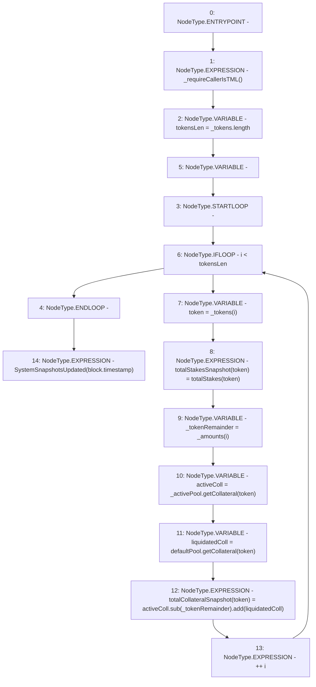

# Context: TroveManager.updateSystemSnapshots_excludeCollRemainder

**Contract:** `TroveManager` (Inherits: ReentrancyGuard, ITroveManager, TroveManagerBase, CheckContract, Ownable, LiquityBase, YetiCustomBase, BaseMath, ILiquityBase)
**Signature:** `updateSystemSnapshots_excludeCollRemainder(IActivePool,address[],uint256[])`
**Method Selector ID:** `0xe1f18250`
**Visibility:** `external`
**Environment-Free:** `No (reads EVM state context)`
**Modifiers:** None

### State Variables Interaction
- **Reads:** defaultPool, totalStakes
- **Writes:** totalCollateralSnapshot, totalStakesSnapshot

### Environment & Verification Flags
- **Uses Foundry Cheatcodes:** No
- **Has Echidna Properties:** No

### Internal Calls Tree
- None

### External Calls / Value Transfers
- `SafeMath.TMP_597(uint256) = LIBRARY_CALL, dest:SafeMath, function:SafeMath.add(uint256,uint256), arguments:['TMP_596', 'liquidatedColl'] `
- `IDefaultPool.TMP_595(uint256) = HIGH_LEVEL_CALL, dest:defaultPool(IDefaultPool), function:getCollateral, arguments:['token']  `
- `IActivePool.TMP_594(uint256) = HIGH_LEVEL_CALL, dest:_activePool(IActivePool), function:getCollateral, arguments:['token']  `
- `SafeMath.TMP_596(uint256) = LIBRARY_CALL, dest:SafeMath, function:SafeMath.sub(uint256,uint256), arguments:['activeColl', '_tokenRemainder'] `

### Control Flow Graph (CFG)


### Source Mapping
Declared in: `certora-ac-datasets/detasets/web3bugs/dataset/web3bugs/66/packages/contracts/contracts/TroveManager.sol` on lines **635** to **648**

```solidity
    function updateSystemSnapshots_excludeCollRemainder(IActivePool _activePool, address[] memory _tokens, uint[] memory _amounts) external override {
        _requireCallerIsTML();
        uint256 tokensLen = _tokens.length;
        for (uint256 i; i < tokensLen; ++i) {
            address token = _tokens[i];
            totalStakesSnapshot[token] = totalStakes[token];

            uint _tokenRemainder = _amounts[i];
            uint activeColl = _activePool.getCollateral(token);
            uint liquidatedColl = defaultPool.getCollateral(token);
            totalCollateralSnapshot[token] = activeColl.sub(_tokenRemainder).add(liquidatedColl);
        }
        emit SystemSnapshotsUpdated(block.timestamp);
    }

```
