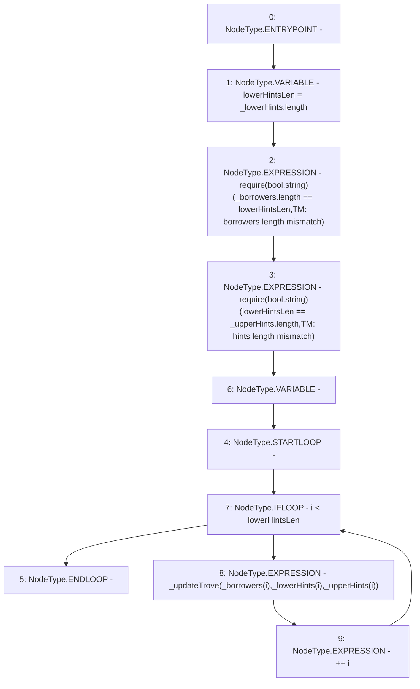

# Context: TroveManager.updateTroves

**Contract:** `TroveManager` (Inherits: ReentrancyGuard, ITroveManager, TroveManagerBase, CheckContract, Ownable, LiquityBase, YetiCustomBase, BaseMath, ILiquityBase)
**Signature:** `updateTroves(address[],address[],address[])`
**Method Selector ID:** `0x3bc8913e`
**Visibility:** `external`
**Environment-Free:** `Yes`
**Modifiers:** None

### State Variables Interaction
- **Reads:** None
- **Writes:** None

### Assertion Checks & Business Requirements
- require/assert: `require(bool,string)(_borrowers.length == lowerHintsLen,TM: borrowers length mismatch)`
- require/assert: `require(bool,string)(lowerHintsLen == _upperHints.length,TM: hints length mismatch)`

### Environment & Verification Flags
- **Uses Foundry Cheatcodes:** No
- **Has Echidna Properties:** No

### Internal Calls Tree
- None

### External Calls / Value Transfers
- None

### Control Flow Graph (CFG)


### Source Mapping
Declared in: `certora-ac-datasets/detasets/web3bugs/dataset/web3bugs/66/packages/contracts/contracts/TroveManager.sol` on lines **256** to **264**

```solidity
    function updateTroves(address[] calldata _borrowers, address[] calldata _lowerHints, address[] calldata _upperHints) external {
        uint lowerHintsLen = _lowerHints.length;
        require(_borrowers.length == lowerHintsLen, "TM: borrowers length mismatch");
        require(lowerHintsLen == _upperHints.length, "TM: hints length mismatch");

        for (uint256 i; i < lowerHintsLen; ++i) {
            _updateTrove(_borrowers[i], _lowerHints[i], _upperHints[i]);
        }
    }

```
