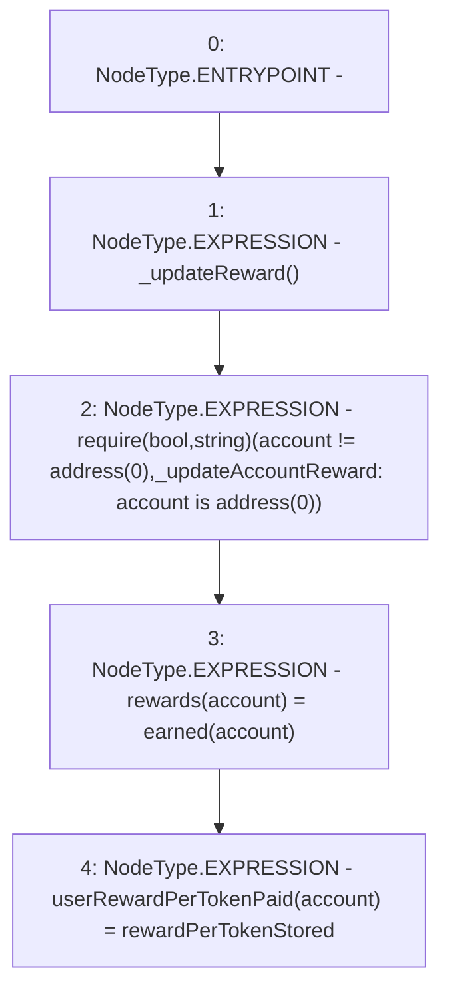

# Context: Unipool._updateAccountReward

**Contract:** `Unipool` (Inherits: IUnipool, CheckContract, Ownable, LPTokenWrapper, ILPTokenWrapper)
**Signature:** `_updateAccountReward(address)`
**Method Selector ID:** `Internal (No Method ID)`
**Visibility:** `internal`
**Environment-Free:** `No (reads EVM state context)`
**Modifiers:** None

### State Variables Interaction
- **Reads:** rewardPerTokenStored
- **Writes:** rewards, userRewardPerTokenPaid

### Assertion Checks & Business Requirements
- require/assert: `require(bool,string)(account != address(0),_updateAccountReward: account is address(0))`

### Environment & Verification Flags
- **Uses Foundry Cheatcodes:** No
- **Has Echidna Properties:** No

### Internal Calls Tree
- None

### External Calls / Value Transfers
- None

### Control Flow Graph (CFG)


### Source Mapping
Declared in: `certora-ac-datasets/detasets/web3bugs/dataset/web3bugs/66/packages/contracts/contracts/LPRewards/Unipool.sol` on lines **236** to **243**

```solidity
    function _updateAccountReward(address account) internal {
        _updateReward();

        require(account != address(0), "_updateAccountReward: account is address(0)");

        rewards[account] = earned(account);
        userRewardPerTokenPaid[account] = rewardPerTokenStored;
    }

```
