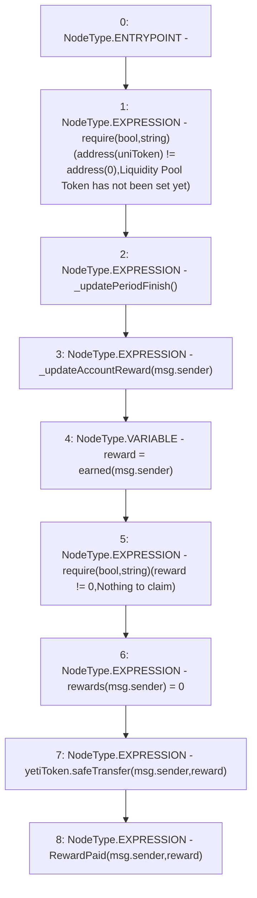

# Context: Unipool.claimReward

**Contract:** `Unipool` (Inherits: IUnipool, CheckContract, Ownable, LPTokenWrapper, ILPTokenWrapper)
**Signature:** `claimReward()`
**Method Selector ID:** `0xb88a802f`
**Visibility:** `public`
**Environment-Free:** `No (reads EVM state context)`
**Modifiers:** None

### State Variables Interaction
- **Reads:** uniToken, yetiToken
- **Writes:** rewards

### Assertion Checks & Business Requirements
- require/assert: `require(bool,string)(address(uniToken) != address(0),Liquidity Pool Token has not been set yet)`
- require/assert: `require(bool,string)(reward != 0,Nothing to claim)`

### Environment & Verification Flags
- **Uses Foundry Cheatcodes:** No
- **Has Echidna Properties:** No

### Internal Calls Tree
- None

### External Calls / Value Transfers
- `SafeERC20.LIBRARY_CALL, dest:SafeERC20, function:SafeERC20.safeTransfer(IERC20,address,uint256), arguments:['yetiToken', 'msg.sender', 'reward'] `

### Control Flow Graph (CFG)


### Source Mapping
Declared in: `certora-ac-datasets/detasets/web3bugs/dataset/web3bugs/66/packages/contracts/contracts/LPRewards/Unipool.sol` on lines **179** to **192**

```solidity
    function claimReward() public override {
        require(address(uniToken) != address(0), "Liquidity Pool Token has not been set yet");

        _updatePeriodFinish();
        _updateAccountReward(msg.sender);

        uint256 reward = earned(msg.sender);

        require(reward != 0, "Nothing to claim");

        rewards[msg.sender] = 0;
        yetiToken.safeTransfer(msg.sender, reward);
        emit RewardPaid(msg.sender, reward);
    }

```
