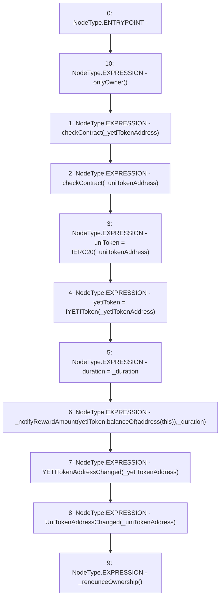

# Context: Unipool.setParams

**Contract:** `Unipool` (Inherits: IUnipool, CheckContract, Ownable, LPTokenWrapper, ILPTokenWrapper)
**Signature:** `setParams(address,address,uint256)`
**Method Selector ID:** `0x509db2f6`
**Visibility:** `external`
**Environment-Free:** `No (reads EVM state context)`
**Modifiers:**
- `onlyOwner`
  ```solidity
  modifier onlyOwner() {
          require(isOwner(), "CallerNotOwner");
          _;
      }
  ```

### State Variables Interaction
- **Reads:** yetiToken
- **Writes:** duration, uniToken, yetiToken

### Environment & Verification Flags
- **Uses Foundry Cheatcodes:** No
- **Has Echidna Properties:** No

### Internal Calls Tree
- None

### External Calls / Value Transfers
- `IYETIToken.TMP_140(uint256) = HIGH_LEVEL_CALL, dest:yetiToken(IYETIToken), function:balanceOf, arguments:['TMP_139']  `

### Control Flow Graph (CFG)


### Source Mapping
Declared in: `certora-ac-datasets/detasets/web3bugs/dataset/web3bugs/66/packages/contracts/contracts/LPRewards/Unipool.sol` on lines **96** to **118**

```solidity
    function setParams(
        address _yetiTokenAddress,
        address _uniTokenAddress,
        uint _duration
    )
        external
        override
        onlyOwner
    {
        checkContract(_yetiTokenAddress);
        checkContract(_uniTokenAddress);

        uniToken = IERC20(_uniTokenAddress);
        yetiToken = IYETIToken(_yetiTokenAddress);
        duration = _duration;

        _notifyRewardAmount(yetiToken.balanceOf(address(this)), _duration);

        emit YETITokenAddressChanged(_yetiTokenAddress);
        emit UniTokenAddressChanged(_uniTokenAddress);

        _renounceOwnership();
    }

```
