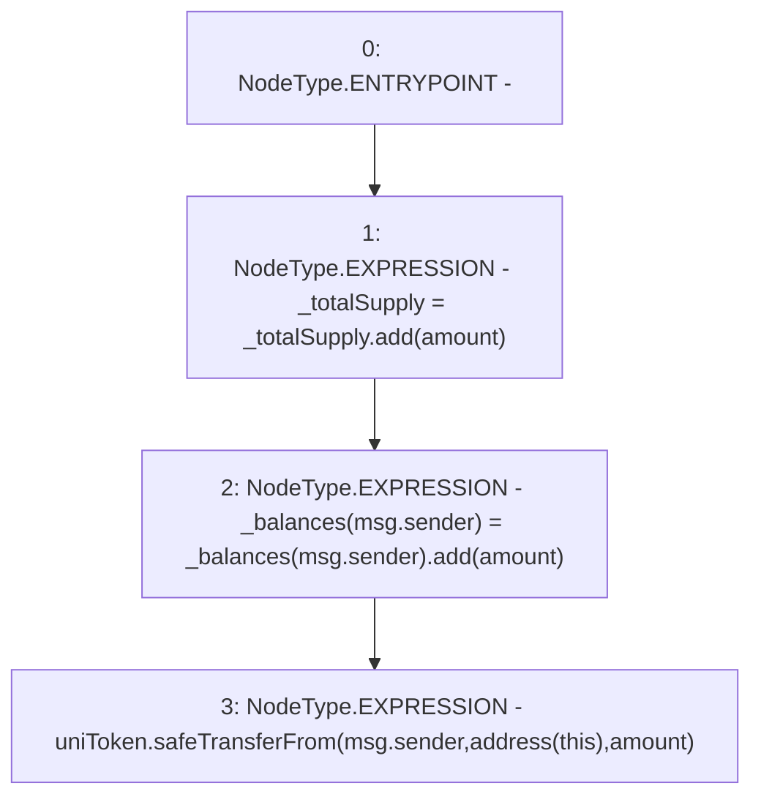

# Context: Unipool.stake

**Contract:** `Unipool` (Inherits: IUnipool, CheckContract, Ownable, LPTokenWrapper, ILPTokenWrapper)
**Signature:** `stake(uint256)`
**Method Selector ID:** `0xa694fc3a`
**Visibility:** `public`
**Environment-Free:** `No (reads EVM state context)`
**Modifiers:** None

### State Variables Interaction
- **Reads:** _balances, _totalSupply, uniToken
- **Writes:** _balances, _totalSupply

### Environment & Verification Flags
- **Uses Foundry Cheatcodes:** No
- **Has Echidna Properties:** No

### Internal Calls Tree
- None

### External Calls / Value Transfers
- `SafeMath.TMP_129(uint256) = LIBRARY_CALL, dest:SafeMath, function:SafeMath.add(uint256,uint256), arguments:['REF_54', 'amount'] `
- `SafeERC20.LIBRARY_CALL, dest:SafeERC20, function:SafeERC20.safeTransferFrom(IERC20,address,address,uint256), arguments:['uniToken', 'msg.sender', 'TMP_130', 'amount'] `
- `SafeMath.TMP_128(uint256) = LIBRARY_CALL, dest:SafeMath, function:SafeMath.add(uint256,uint256), arguments:['_totalSupply', 'amount'] `

### Control Flow Graph (CFG)


### Source Mapping
Declared in: `certora-ac-datasets/detasets/web3bugs/dataset/web3bugs/66/packages/contracts/contracts/LPRewards/Unipool.sol` on lines **40** to **44**

```solidity
    function stake(uint256 amount) public virtual override {
        _totalSupply = _totalSupply.add(amount);
        _balances[msg.sender] = _balances[msg.sender].add(amount);
        uniToken.safeTransferFrom(msg.sender, address(this), amount);
    }

```
