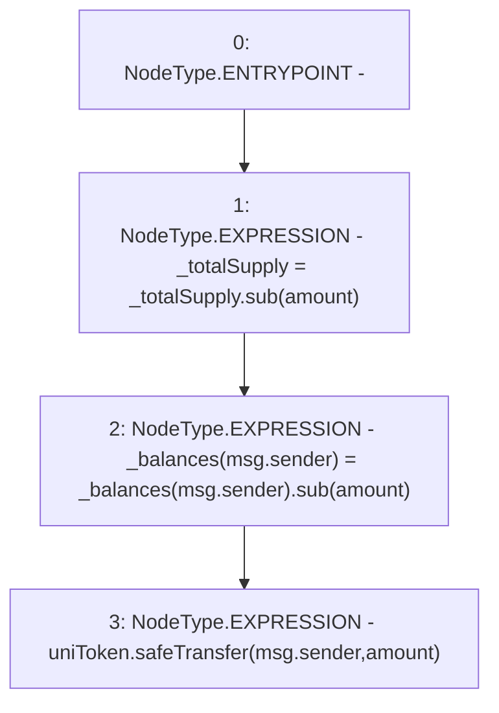

# Context: Unipool.withdraw

**Contract:** `Unipool` (Inherits: IUnipool, CheckContract, Ownable, LPTokenWrapper, ILPTokenWrapper)
**Signature:** `withdraw(uint256)`
**Method Selector ID:** `0x2e1a7d4d`
**Visibility:** `public`
**Environment-Free:** `No (reads EVM state context)`
**Modifiers:** None

### State Variables Interaction
- **Reads:** _balances, _totalSupply, uniToken
- **Writes:** _balances, _totalSupply

### Environment & Verification Flags
- **Uses Foundry Cheatcodes:** No
- **Has Echidna Properties:** No

### Internal Calls Tree
- None

### External Calls / Value Transfers
- `SafeERC20.LIBRARY_CALL, dest:SafeERC20, function:SafeERC20.safeTransfer(IERC20,address,uint256), arguments:['uniToken', 'msg.sender', 'amount'] `
- `SafeMath.TMP_132(uint256) = LIBRARY_CALL, dest:SafeMath, function:SafeMath.sub(uint256,uint256), arguments:['_totalSupply', 'amount'] `
- `SafeMath.TMP_133(uint256) = LIBRARY_CALL, dest:SafeMath, function:SafeMath.sub(uint256,uint256), arguments:['REF_59', 'amount'] `

### Control Flow Graph (CFG)


### Source Mapping
Declared in: `certora-ac-datasets/detasets/web3bugs/dataset/web3bugs/66/packages/contracts/contracts/LPRewards/Unipool.sol` on lines **46** to **50**

```solidity
    function withdraw(uint256 amount) public virtual override {
        _totalSupply = _totalSupply.sub(amount);
        _balances[msg.sender] = _balances[msg.sender].sub(amount);
        uniToken.safeTransfer(msg.sender, amount);
    }

```
