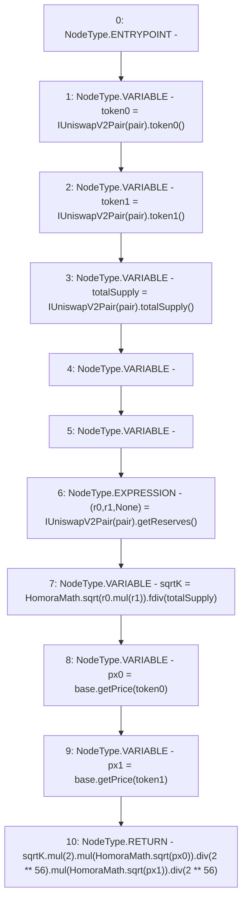

# Context: UniswapV2LPTokenPriceFeed.fetchPrice_v

**Contract:** `UniswapV2LPTokenPriceFeed` (Inherits: Ownable, IPriceFeed)
**Signature:** `fetchPrice_v() returns (uint256)`
**Method Selector ID:** `0x9c3bc3e6`
**Visibility:** `external`
**Environment-Free:** `Yes`
**Modifiers:** None

### State Variables Interaction
- **Reads:** base, pair
- **Writes:** None

### Environment & Verification Flags
- **Uses Foundry Cheatcodes:** No
- **Has Echidna Properties:** No

### Internal Calls Tree
- None

### External Calls / Value Transfers
- `HomoraMath.TMP_84(uint256) = LIBRARY_CALL, dest:HomoraMath, function:HomoraMath.fdiv(uint256,uint256), arguments:['TMP_83', 'totalSupply'] `
- `HomoraMath.TMP_92(uint256) = LIBRARY_CALL, dest:HomoraMath, function:HomoraMath.sqrt(uint256), arguments:['px1'] `
- `SafeMath.TMP_89(uint256) = LIBRARY_CALL, dest:SafeMath, function:SafeMath.mul(uint256,uint256), arguments:['TMP_87', 'TMP_88'] `
- `IBaseOracle.TMP_85(uint256) = HIGH_LEVEL_CALL, dest:base(IBaseOracle), function:getPrice, arguments:['token0']  `
- `IUniswapV2Pair.TUPLE_0(uint112,uint112,uint32) = HIGH_LEVEL_CALL, dest:TMP_81(IUniswapV2Pair), function:getReserves, arguments:[]  `
- `HomoraMath.TMP_88(uint256) = LIBRARY_CALL, dest:HomoraMath, function:HomoraMath.sqrt(uint256), arguments:['px0'] `
- `SafeMath.TMP_93(uint256) = LIBRARY_CALL, dest:SafeMath, function:SafeMath.mul(uint256,uint256), arguments:['TMP_91', 'TMP_92'] `
- `IBaseOracle.TMP_86(uint256) = HIGH_LEVEL_CALL, dest:base(IBaseOracle), function:getPrice, arguments:['token1']  `
- `IUniswapV2Pair.TMP_78(address) = HIGH_LEVEL_CALL, dest:TMP_77(IUniswapV2Pair), function:token1, arguments:[]  `
- `IUniswapV2Pair.TMP_76(address) = HIGH_LEVEL_CALL, dest:TMP_75(IUniswapV2Pair), function:token0, arguments:[]  `
- `IUniswapV2Pair.TMP_80(uint256) = HIGH_LEVEL_CALL, dest:TMP_79(IUniswapV2Pair), function:totalSupply, arguments:[]  `
- `HomoraMath.TMP_83(uint256) = LIBRARY_CALL, dest:HomoraMath, function:HomoraMath.sqrt(uint256), arguments:['TMP_82'] `
- `SafeMath.TMP_82(uint256) = LIBRARY_CALL, dest:SafeMath, function:SafeMath.mul(uint256,uint256), arguments:['r0', 'r1'] `
- `SafeMath.TMP_87(uint256) = LIBRARY_CALL, dest:SafeMath, function:SafeMath.mul(uint256,uint256), arguments:['sqrtK', '2'] `
- `SafeMath.TMP_95(uint256) = LIBRARY_CALL, dest:SafeMath, function:SafeMath.div(uint256,uint256), arguments:['TMP_93', 'TMP_94'] `
- `SafeMath.TMP_91(uint256) = LIBRARY_CALL, dest:SafeMath, function:SafeMath.div(uint256,uint256), arguments:['TMP_89', 'TMP_90'] `

### Control Flow Graph (CFG)


### Source Mapping
Declared in: `certora-ac-datasets/detasets/web3bugs/dataset/web3bugs/66/packages/contracts/contracts/Oracles/LPTokenPriceFeed.sol` on lines **26** to **39**

```solidity
  function fetchPrice_v() external view override returns (uint) {
    address token0 = IUniswapV2Pair(pair).token0();
    address token1 = IUniswapV2Pair(pair).token1();
    uint totalSupply = IUniswapV2Pair(pair).totalSupply();
    (uint r0, uint r1, ) = IUniswapV2Pair(pair).getReserves();
    uint sqrtK = HomoraMath.sqrt(r0.mul(r1)).fdiv(totalSupply); // in 2**112
    uint px0 = base.getPrice(token0); // in 2**112
    uint px1 = base.getPrice(token1); // in 2**112
    // fair token0 amt: sqrtK * sqrt(px1/px0)
    // fair token1 amt: sqrtK * sqrt(px0/px1)
    // fair lp price = 2 * sqrt(px0 * px1)
    // split into 2 sqrts multiplication to prevent uint overflow (note the 2**112)
    return sqrtK.mul(2).mul(HomoraMath.sqrt(px0)).div(2**56).mul(HomoraMath.sqrt(px1)).div(2**56);
  }

```
