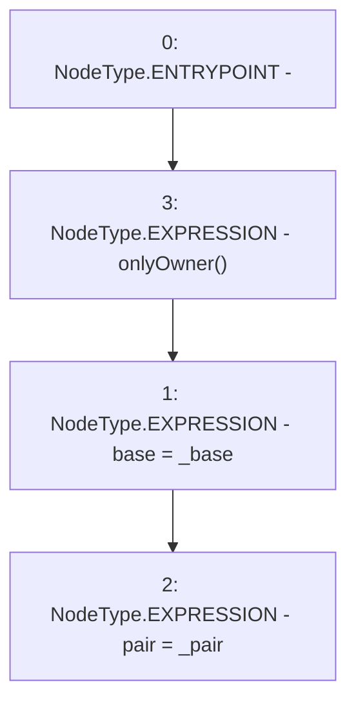

# Context: UniswapV2LPTokenPriceFeed.setParam

**Contract:** `UniswapV2LPTokenPriceFeed` (Inherits: Ownable, IPriceFeed)
**Signature:** `setParam(IBaseOracle,address)`
**Method Selector ID:** `0xeb6e11fc`
**Visibility:** `external`
**Environment-Free:** `No (reads EVM state context)`
**Modifiers:**
- `onlyOwner`
  ```solidity
  modifier onlyOwner() {
          require(isOwner(), "CallerNotOwner");
          _;
      }
  ```

### State Variables Interaction
- **Reads:** None
- **Writes:** base, pair

### Environment & Verification Flags
- **Uses Foundry Cheatcodes:** No
- **Has Echidna Properties:** No

### Internal Calls Tree
- None

### External Calls / Value Transfers
- None

### Control Flow Graph (CFG)


### Source Mapping
Declared in: `certora-ac-datasets/detasets/web3bugs/dataset/web3bugs/66/packages/contracts/contracts/Oracles/LPTokenPriceFeed.sol` on lines **20** to **23**

```solidity
  function setParam(IBaseOracle _base, address _pair) external onlyOwner {
    base = _base;
    pair = _pair;
  }

```
