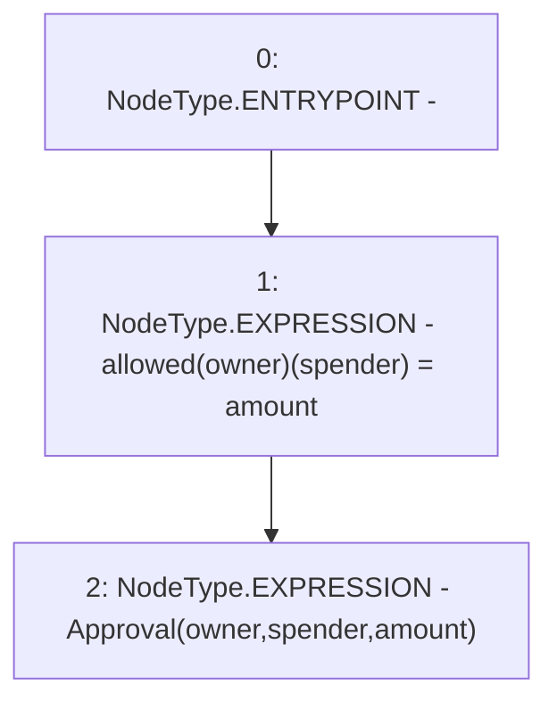

# Context: WAAVE._approve

**Contract:** `WAAVE` (Inherits: IWAsset, ERC20_8, IERC20)
**Signature:** `_approve(address,address,uint256)`
**Method Selector ID:** `Internal (No Method ID)`
**Visibility:** `internal`
**Environment-Free:** `Yes`
**Modifiers:** None

### State Variables Interaction
- **Reads:** None
- **Writes:** allowed

### Environment & Verification Flags
- **Uses Foundry Cheatcodes:** No
- **Has Echidna Properties:** No

### Internal Calls Tree
- None

### External Calls / Value Transfers
- None

### Control Flow Graph (CFG)


### Source Mapping
Declared in: `certora-ac-datasets/detasets/web3bugs/dataset/web3bugs/66/packages/contracts/contracts/AssetWrappers/ERC20_8.sol` on lines **97** to **100**

```solidity
    function _approve(address owner, address spender, uint256 amount) internal {
        allowed[owner][spender] = amount;
        emit Approval(owner, spender, amount);
    }

```
