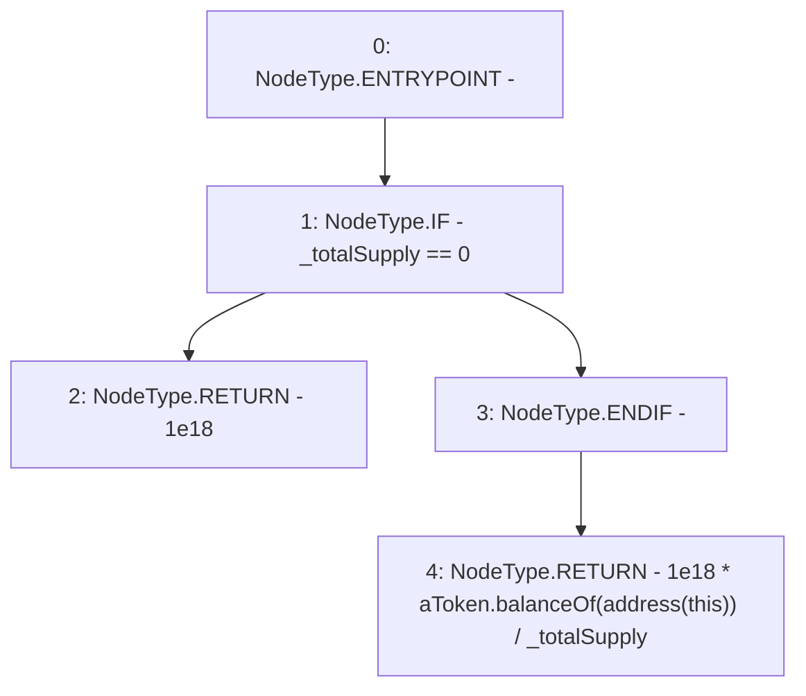

# Context: WAAVE.aavePerShare

**Contract:** `WAAVE` (Inherits: IWAsset, ERC20_8, IERC20)
**Signature:** `aavePerShare() returns (uint256)`
**Method Selector ID:** `0xcb337bb0`
**Visibility:** `public`
**Environment-Free:** `Yes`
**Modifiers:** None

### State Variables Interaction
- **Reads:** _totalSupply, aToken
- **Writes:** None

### Environment & Verification Flags
- **Uses Foundry Cheatcodes:** No
- **Has Echidna Properties:** No

### Internal Calls Tree
- None

### External Calls / Value Transfers
- `IERC20.TMP_58(uint256) = HIGH_LEVEL_CALL, dest:aToken(IERC20), function:balanceOf, arguments:['TMP_57']  `

### Control Flow Graph (CFG)


### Source Mapping
Declared in: `certora-ac-datasets/detasets/web3bugs/dataset/web3bugs/66/packages/contracts/contracts/AssetWrappers/WAAVE.sol` on lines **93** to **98**

```solidity
    function aavePerShare() public view returns (uint) {
        if (_totalSupply==0) {
            return 1e18;
        }
        return 1e18*aToken.balanceOf(address(this))/_totalSupply;
    }

```
