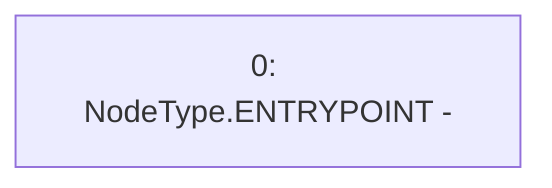

# Context: WAAVE.claimReward

**Contract:** `WAAVE` (Inherits: IWAsset, ERC20_8, IERC20)
**Signature:** `claimReward(address)`
**Method Selector ID:** `0xd279c191`
**Visibility:** `external`
**Environment-Free:** `Yes`
**Modifiers:** None

### State Variables Interaction
- **Reads:** None
- **Writes:** None

### Environment & Verification Flags
- **Uses Foundry Cheatcodes:** No
- **Has Echidna Properties:** No

### Internal Calls Tree
- None

### External Calls / Value Transfers
- None

### Control Flow Graph (CFG)


### Source Mapping
Declared in: `certora-ac-datasets/detasets/web3bugs/dataset/web3bugs/66/packages/contracts/contracts/AssetWrappers/WAAVE.sol` on lines **169** to **171**

```solidity
    function claimReward(address _to) external override {
        // _sendReward(msg.sender, _to);
    }

```
