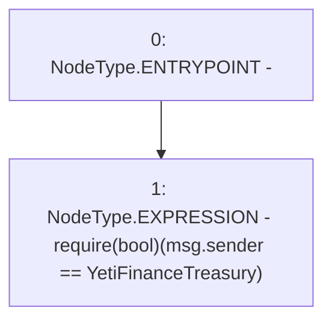

# Context: WAAVE.claimRewardTreasury

**Contract:** `WAAVE` (Inherits: IWAsset, ERC20_8, IERC20)
**Signature:** `claimRewardTreasury()`
**Method Selector ID:** `0xe9b5f256`
**Visibility:** `external`
**Environment-Free:** `No (reads EVM state context)`
**Modifiers:** None

### State Variables Interaction
- **Reads:** YetiFinanceTreasury
- **Writes:** None

### Assertion Checks & Business Requirements
- require/assert: `require(bool)(msg.sender == YetiFinanceTreasury)`

### Environment & Verification Flags
- **Uses Foundry Cheatcodes:** No
- **Has Echidna Properties:** No

### Internal Calls Tree
- None

### External Calls / Value Transfers
- None

### Control Flow Graph (CFG)


### Source Mapping
Declared in: `certora-ac-datasets/detasets/web3bugs/dataset/web3bugs/66/packages/contracts/contracts/AssetWrappers/WAAVE.sol` on lines **162** to **165**

```solidity
    function claimRewardTreasury() external {
        require(msg.sender==YetiFinanceTreasury);

    }

```
