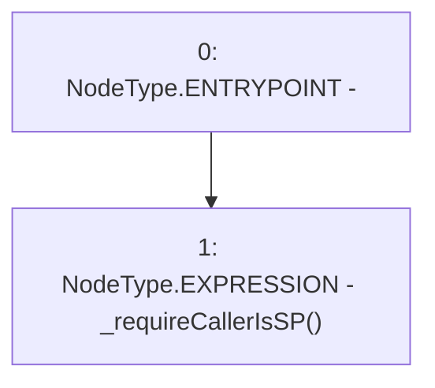

# Context: WAAVE.endTreasuryReward

**Contract:** `WAAVE` (Inherits: IWAsset, ERC20_8, IERC20)
**Signature:** `endTreasuryReward(address,uint256)`
**Method Selector ID:** `0xca70560a`
**Visibility:** `external`
**Environment-Free:** `No (reads EVM state context)`
**Modifiers:** None

### State Variables Interaction
- **Reads:** None
- **Writes:** None

### Environment & Verification Flags
- **Uses Foundry Cheatcodes:** No
- **Has Echidna Properties:** No

### Internal Calls Tree
- None

### External Calls / Value Transfers
- None

### Control Flow Graph (CFG)


### Source Mapping
Declared in: `certora-ac-datasets/detasets/web3bugs/dataset/web3bugs/66/packages/contracts/contracts/AssetWrappers/WAAVE.sol` on lines **130** to **132**

```solidity
    function endTreasuryReward(address _to, uint _amount) external override {
        _requireCallerIsSP();
    }

```
