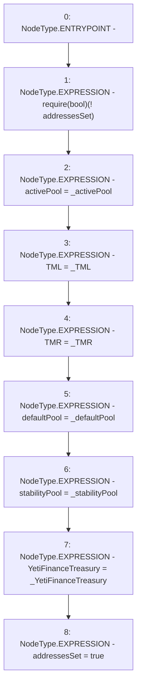

# Context: WAAVE.setAddresses

**Contract:** `WAAVE` (Inherits: IWAsset, ERC20_8, IERC20)
**Signature:** `setAddresses(address,address,address,address,address,address)`
**Method Selector ID:** `0x6cfb6bf9`
**Visibility:** `external`
**Environment-Free:** `Yes`
**Modifiers:** None

### State Variables Interaction
- **Reads:** addressesSet
- **Writes:** TML, TMR, YetiFinanceTreasury, activePool, addressesSet, defaultPool, stabilityPool

### Assertion Checks & Business Requirements
- require/assert: `require(bool)(! addressesSet)`

### Environment & Verification Flags
- **Uses Foundry Cheatcodes:** No
- **Has Echidna Properties:** No

### Internal Calls Tree
- None

### External Calls / Value Transfers
- None

### Control Flow Graph (CFG)


### Source Mapping
Declared in: `certora-ac-datasets/detasets/web3bugs/dataset/web3bugs/66/packages/contracts/contracts/AssetWrappers/WAAVE.sol` on lines **58** to **73**

```solidity
    function setAddresses(
        address _activePool,
        address _TML,
        address _TMR,
        address _defaultPool,
        address _stabilityPool,
        address _YetiFinanceTreasury) external {
        require(!addressesSet);
        activePool = _activePool;
        TML = _TML;
        TMR = _TMR;
        defaultPool = _defaultPool;
        stabilityPool = _stabilityPool;
        YetiFinanceTreasury = _YetiFinanceTreasury;
        addressesSet = true;
    }

```
