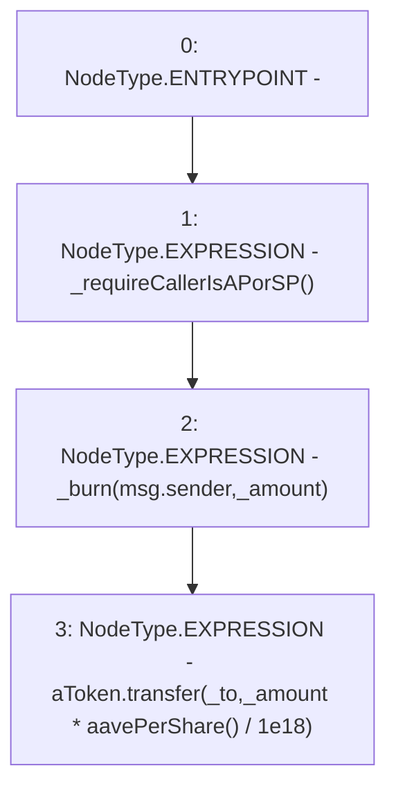

# Context: WAAVE.unwrapFor

**Contract:** `WAAVE` (Inherits: IWAsset, ERC20_8, IERC20)
**Signature:** `unwrapFor(address,address,uint256)`
**Method Selector ID:** `0x261c80b6`
**Visibility:** `external`
**Environment-Free:** `No (reads EVM state context)`
**Modifiers:** None

### State Variables Interaction
- **Reads:** aToken
- **Writes:** None

### Environment & Verification Flags
- **Uses Foundry Cheatcodes:** No
- **Has Echidna Properties:** No

### Internal Calls Tree
- None

### External Calls / Value Transfers
- `IERC20.TMP_71(bool) = HIGH_LEVEL_CALL, dest:aToken(IERC20), function:transfer, arguments:['_to', 'TMP_70']  `

### Control Flow Graph (CFG)


### Source Mapping
Declared in: `certora-ac-datasets/detasets/web3bugs/dataset/web3bugs/66/packages/contracts/contracts/AssetWrappers/WAAVE.sol` on lines **113** to **124**

```solidity
    function unwrapFor(address _from, address _to, uint _amount) external override {
        _requireCallerIsAPorSP();
        // accumulateRewards(msg.sender);
        // _MasterChefJoe.withdraw(_poolPid, _amount);

        // msg.sender is either Active Pool or Stability Pool
        // each one has the ability to unwrap and burn WAssets they own and
        // send them to someone else
        // userInfo[_to].amount=userInfo[_to].amount-_amount;
        _burn(msg.sender, _amount);
        aToken.transfer(_to, _amount*aavePerShare()/1e18);
    }

```
