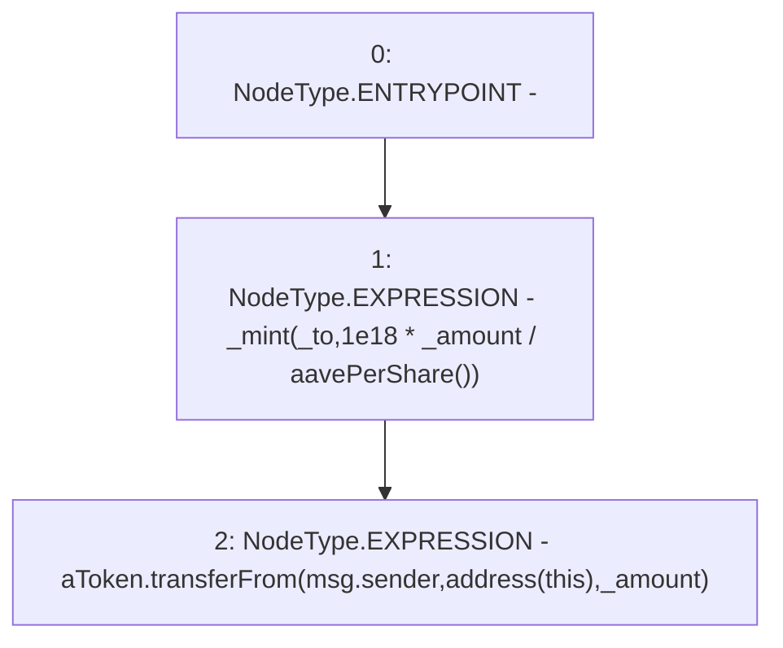

# Context: WAAVE.wrap

**Contract:** `WAAVE` (Inherits: IWAsset, ERC20_8, IERC20)
**Signature:** `wrap(uint256,address,address,address)`
**Method Selector ID:** `0x932eeefe`
**Visibility:** `external`
**Environment-Free:** `No (reads EVM state context)`
**Modifiers:** None

### State Variables Interaction
- **Reads:** aToken
- **Writes:** None

### Environment & Verification Flags
- **Uses Foundry Cheatcodes:** No
- **Has Echidna Properties:** No

### Internal Calls Tree
- None

### External Calls / Value Transfers
- `IERC20.TMP_55(bool) = HIGH_LEVEL_CALL, dest:aToken(IERC20), function:transferFrom, arguments:['msg.sender', 'TMP_54', '_amount']  `

### Control Flow Graph (CFG)


### Source Mapping
Declared in: `certora-ac-datasets/detasets/web3bugs/dataset/web3bugs/66/packages/contracts/contracts/AssetWrappers/WAAVE.sol` on lines **85** to **90**

```solidity
    function wrap(uint _amount, address _from, address _to, address _rewardRecipient) external override {
        
        _mint(_to, 1e18*_amount/aavePerShare());
        aToken.transferFrom(msg.sender, address(this), _amount);
        
    }

```
