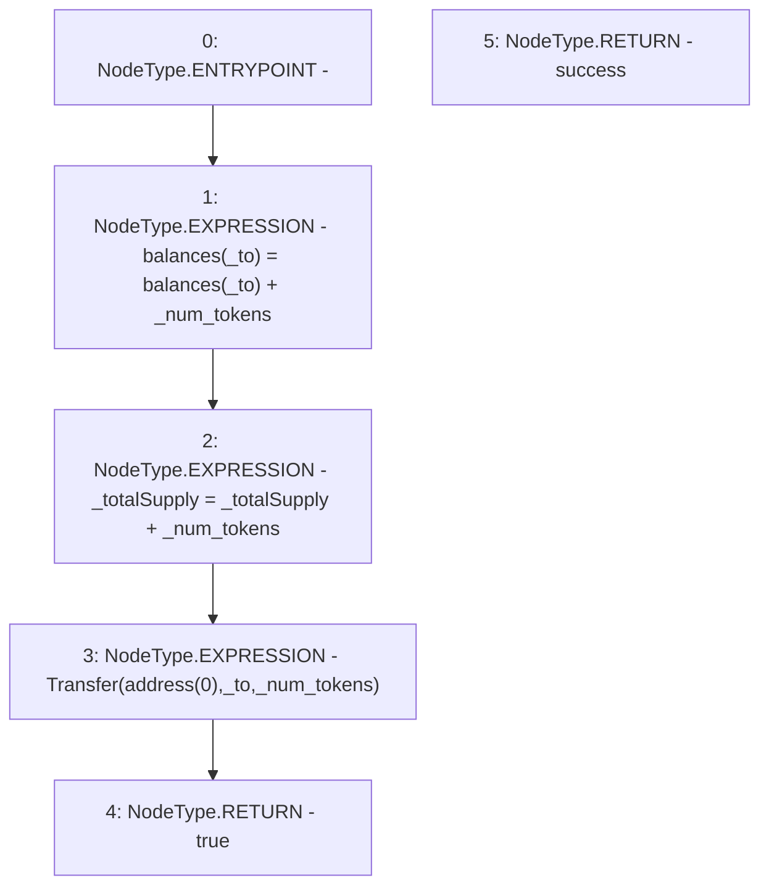

# Context: WBQI._mint

**Contract:** `WBQI` (Inherits: IWAsset, ERC20_8, IERC20)
**Signature:** `_mint(address,uint256) returns (bool)`
**Method Selector ID:** `Internal (No Method ID)`
**Visibility:** `internal`
**Environment-Free:** `Yes`
**Modifiers:** None

### State Variables Interaction
- **Reads:** _totalSupply, balances
- **Writes:** _totalSupply, balances

### Environment & Verification Flags
- **Uses Foundry Cheatcodes:** No
- **Has Echidna Properties:** No

### Internal Calls Tree
- None

### External Calls / Value Transfers
- None

### Control Flow Graph (CFG)


### Source Mapping
Declared in: `certora-ac-datasets/detasets/web3bugs/dataset/web3bugs/66/packages/contracts/contracts/AssetWrappers/ERC20_8.sol` on lines **129** to **134**

```solidity
    function _mint(address _to, uint _num_tokens) internal returns (bool success) {
        balances[_to] = balances[_to] + _num_tokens;
        _totalSupply= _totalSupply+_num_tokens;
        emit Transfer(address(0), _to, _num_tokens);
        return true;
    }

```
