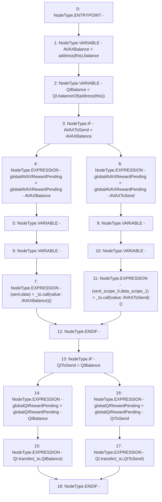

# Context: WBQI._safeRewardsTransfer

**Contract:** `WBQI` (Inherits: IWAsset, ERC20_8, IERC20)
**Signature:** `_safeRewardsTransfer(address,uint256,uint256)`
**Method Selector ID:** `Internal (No Method ID)`
**Visibility:** `internal`
**Environment-Free:** `Yes`
**Modifiers:** None

### State Variables Interaction
- **Reads:** QI, globalAVAXRewardPending, globalQIRewardPending
- **Writes:** globalAVAXRewardPending, globalQIRewardPending

### Environment & Verification Flags
- **Uses Foundry Cheatcodes:** No
- **Has Echidna Properties:** No

### Internal Calls Tree
- None

### External Calls / Value Transfers
- `IERC20.TMP_123(uint256) = HIGH_LEVEL_CALL, dest:QI(IERC20), function:balanceOf, arguments:['TMP_122']  `
- `low-level-call`
- `IERC20.TMP_129(bool) = HIGH_LEVEL_CALL, dest:QI(IERC20), function:transfer, arguments:['_to', 'QIBalance']  `
- `IERC20.TMP_131(bool) = HIGH_LEVEL_CALL, dest:QI(IERC20), function:transfer, arguments:['_to', 'QIToSend']  `

### Control Flow Graph (CFG)


### Source Mapping
Declared in: `certora-ac-datasets/detasets/web3bugs/dataset/web3bugs/66/packages/contracts/contracts/AssetWrappers/WBQI.sol` on lines **248** to **266**

```solidity
    function _safeRewardsTransfer(address _to, uint256 AVAXToSend, uint256 QIToSend) internal {
        uint256 AVAXBalance = address(this).balance;
        uint256 QIBalance = QI.balanceOf(address(this));
       
        if (AVAXToSend > AVAXBalance) {
            globalAVAXRewardPending=globalAVAXRewardPending-AVAXBalance;
            (bool sent, bytes memory data) = _to.call{value: AVAXBalance}("");
        } else {
            globalAVAXRewardPending=globalAVAXRewardPending-AVAXToSend;
            (bool sent, bytes memory data) = _to.call{value: AVAXToSend}("");
        }
        if (QIToSend > QIBalance) {
            globalQIRewardPending=globalQIRewardPending-QIBalance;
            QI.transfer(_to, QIBalance);
        } else {
            globalQIRewardPending=globalQIRewardPending-QIToSend;
            QI.transfer(_to, QIToSend);
        }
    }

```
