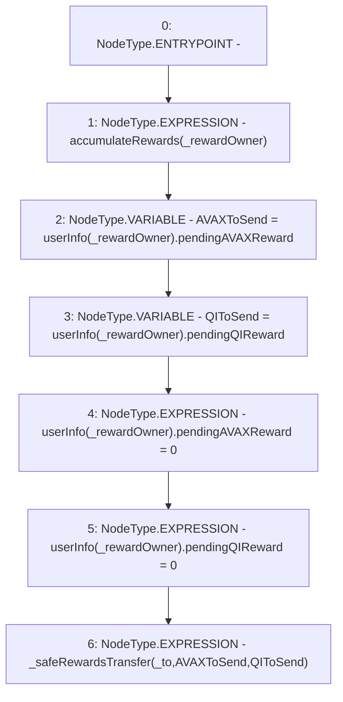

# Context: WBQI._sendReward

**Contract:** `WBQI` (Inherits: IWAsset, ERC20_8, IERC20)
**Signature:** `_sendReward(address,address)`
**Method Selector ID:** `Internal (No Method ID)`
**Visibility:** `internal`
**Environment-Free:** `Yes`
**Modifiers:** None

### State Variables Interaction
- **Reads:** userInfo
- **Writes:** userInfo

### Environment & Verification Flags
- **Uses Foundry Cheatcodes:** No
- **Has Echidna Properties:** No

### Internal Calls Tree
- None

### External Calls / Value Transfers
- None

### Control Flow Graph (CFG)


### Source Mapping
Declared in: `certora-ac-datasets/detasets/web3bugs/dataset/web3bugs/66/packages/contracts/contracts/AssetWrappers/WBQI.sol` on lines **228** to **240**

```solidity
    function _sendReward(address _rewardOwner, address _to) internal {
        //Update rewards
        
        accumulateRewards(_rewardOwner);

        uint AVAXToSend=userInfo[_rewardOwner].pendingAVAXReward;
        uint QIToSend=userInfo[_rewardOwner].pendingQIReward;
        userInfo[_rewardOwner].pendingAVAXReward=0;
        userInfo[_rewardOwner].pendingQIReward=0;

        _safeRewardsTransfer(_to, AVAXToSend, QIToSend);
        
    }

```
