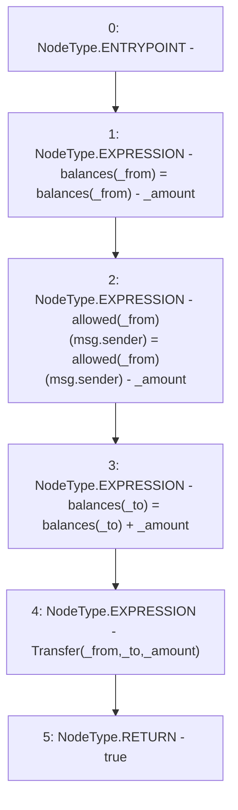

# Context: WBQI._transferFrom

**Contract:** `WBQI` (Inherits: IWAsset, ERC20_8, IERC20)
**Signature:** `_transferFrom(address,address,uint256) returns (bool)`
**Method Selector ID:** `Internal (No Method ID)`
**Visibility:** `internal`
**Environment-Free:** `No (reads EVM state context)`
**Modifiers:** None

### State Variables Interaction
- **Reads:** allowed, balances
- **Writes:** allowed, balances

### Environment & Verification Flags
- **Uses Foundry Cheatcodes:** No
- **Has Echidna Properties:** No

### Internal Calls Tree
- None

### External Calls / Value Transfers
- None

### Control Flow Graph (CFG)


### Source Mapping
Declared in: `certora-ac-datasets/detasets/web3bugs/dataset/web3bugs/66/packages/contracts/contracts/AssetWrappers/ERC20_8.sol` on lines **117** to **123**

```solidity
    function _transferFrom(address _from, address _to, uint _amount) internal returns (bool) {
        balances[_from] = balances[_from] - _amount;
        allowed[_from][msg.sender] = allowed[_from][msg.sender] - _amount;
        balances[_to] = balances[_to] + _amount;
        emit Transfer(_from, _to, _amount);
        return true;
    }

```
