# Context: WBQI.accumulateRewards

**Contract:** `WBQI` (Inherits: IWAsset, ERC20_8, IERC20)
**Signature:** `accumulateRewards(address)`
**Method Selector ID:** `Internal (No Method ID)`
**Visibility:** `internal`
**Environment-Free:** `Yes`
**Modifiers:** None

### State Variables Interaction
- **Reads:** QI, SHAREOFFSET, _Comptroller, _totalSupply, globalAVAXRewardPending, globalQIRewardPending, qiTokens, userInfo
- **Writes:** globalAVAXRewardPending, globalQIRewardPending, userInfo

### Environment & Verification Flags
- **Uses Foundry Cheatcodes:** No
- **Has Echidna Properties:** No

### Internal Calls Tree
- None

### External Calls / Value Transfers
- `IERC20.TMP_75(uint256) = HIGH_LEVEL_CALL, dest:QI(IERC20), function:balanceOf, arguments:['TMP_74']  `
- `IComptroller.HIGH_LEVEL_CALL, dest:_Comptroller(IComptroller), function:claimReward, arguments:['TMP_59', 'TMP_61', 'qiTokens']  `
- `IERC20.TMP_93(uint256) = HIGH_LEVEL_CALL, dest:QI(IERC20), function:balanceOf, arguments:['TMP_92']  `
- `IComptroller.HIGH_LEVEL_CALL, dest:_Comptroller(IComptroller), function:claimReward, arguments:['TMP_55', 'TMP_57', 'qiTokens']  `

### Control Flow Graph (CFG)

```mermaid
flowchart TD
    Node_0["0: NodeType.ENTRYPOINT - "]
    Node_0 --> Node_1
    Node_1["1: NodeType.EXPRESSION - _Comptroller.claimReward(uint8(0),address(address(this)),qiTokens)"]
    Node_1 --> Node_2
    Node_2["2: NodeType.EXPRESSION - _Comptroller.claimReward(uint8(1),address(address(this)),qiTokens)"]
    Node_2 --> Node_3
    Node_3["3: NodeType.VARIABLE - local = userInfo(_user)"]
    Node_3 --> Node_4
    Node_4["4: NodeType.IF - local.amount > 0"]
    Node_4 --> Node_5
    Node_4 --> Node_19
    Node_5["5: NodeType.VARIABLE - "]
    Node_5 --> Node_6
    Node_6["6: NodeType.VARIABLE - "]
    Node_6 --> Node_7
    Node_7["7: NodeType.IF - local.outstandingShares > 0"]
    Node_7 --> Node_8
    Node_7 --> Node_10
    Node_8["8: NodeType.EXPRESSION - initialAVAXPerShare = (local.snapshotAVAX * SHAREOFFSET) / local.outstandingShares"]
    Node_8 --> Node_9
    Node_9["9: NodeType.EXPRESSION - initialQIPerShare = (local.snapshotQI * SHAREOFFSET) / local.outstandingShares"]
    Node_9 --> Node_10
    Node_10["10: NodeType.ENDIF - "]
    Node_10 --> Node_11
    Node_11["11: NodeType.VARIABLE - currentAVAXPerShare = ((address(this).balance - globalAVAXRewardPending) * SHAREOFFSET) / _totalSupply"]
    Node_11 --> Node_12
    Node_12["12: NodeType.VARIABLE - currentQIPerShare = ((QI.balanceOf(address(this)) - globalQIRewardPending) * SHAREOFFSET) / _totalSupply"]
    Node_12 --> Node_13
    Node_13["13: NodeType.VARIABLE - AVAXReward = ((currentAVAXPerShare - initialAVAXPerShare) * local.amount) / SHAREOFFSET"]
    Node_13 --> Node_14
    Node_14["14: NodeType.VARIABLE - QIReward = ((currentQIPerShare - initialQIPerShare) * local.amount) / SHAREOFFSET"]
    Node_14 --> Node_15
    Node_15["15: NodeType.EXPRESSION - local.pendingAVAXReward = local.pendingAVAXReward + AVAXReward"]
    Node_15 --> Node_16
    Node_16["16: NodeType.EXPRESSION - local.pendingQIReward = local.pendingQIReward + QIReward"]
    Node_16 --> Node_17
    Node_17["17: NodeType.EXPRESSION - globalAVAXRewardPending = globalAVAXRewardPending + AVAXReward"]
    Node_17 --> Node_18
    Node_18["18: NodeType.EXPRESSION - globalQIRewardPending = globalQIRewardPending + QIReward"]
    Node_18 --> Node_19
    Node_19["19: NodeType.ENDIF - "]
    Node_19 --> Node_20
    Node_20["20: NodeType.EXPRESSION - local.snapshotAVAX = address(this).balance - globalAVAXRewardPending"]
    Node_20 --> Node_21
    Node_21["21: NodeType.EXPRESSION - local.snapshotQI = QI.balanceOf(address(this)) - globalQIRewardPending"]
    Node_21 --> Node_22
    Node_22["22: NodeType.EXPRESSION - local.outstandingShares = _totalSupply"]
    Node_22 --> Node_23
    Node_23["23: NodeType.EXPRESSION - userInfo(_user) = local"]
```


### Source Mapping
Declared in: `certora-ac-datasets/detasets/web3bugs/dataset/web3bugs/66/packages/contracts/contracts/AssetWrappers/WBQI.sol` on lines **118** to **148**

```solidity
    function accumulateRewards(address _user) internal {
        _Comptroller.claimReward(uint8(0), payable(address(this)), qiTokens);
        _Comptroller.claimReward(uint8(1), payable(address(this)), qiTokens);
        UserInfo memory local = userInfo[_user];
        if (local.amount>0) {
            uint initialAVAXPerShare;
            uint initialQIPerShare;
            if (local.outstandingShares>0) {
                initialAVAXPerShare=(local.snapshotAVAX*SHAREOFFSET)/local.outstandingShares;
                initialQIPerShare=(local.snapshotQI*SHAREOFFSET)/local.outstandingShares;
            }
            
   
            uint currentAVAXPerShare=((address(this).balance-globalAVAXRewardPending)*SHAREOFFSET)/_totalSupply;
            uint currentQIPerShare=((QI.balanceOf(address(this))-globalQIRewardPending)*SHAREOFFSET)/_totalSupply;
            
            uint AVAXReward= ((currentAVAXPerShare-initialAVAXPerShare)*local.amount)/SHAREOFFSET;
            uint QIReward= ((currentQIPerShare-initialQIPerShare)*local.amount)/SHAREOFFSET;
     
            local.pendingAVAXReward = local.pendingAVAXReward + AVAXReward;
            local.pendingQIReward = local.pendingQIReward + QIReward;
            globalAVAXRewardPending = globalAVAXRewardPending + AVAXReward;
            globalQIRewardPending = globalQIRewardPending + QIReward;
        }
       
        local.snapshotAVAX = address(this).balance-globalAVAXRewardPending;
        
        local.snapshotQI = QI.balanceOf(address(this))-globalQIRewardPending;
        local.outstandingShares = _totalSupply;
        userInfo[_user] = local;
    }

```
