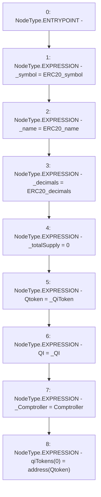

# Context: WBQI.constructor

**Contract:** `WBQI` (Inherits: IWAsset, ERC20_8, IERC20)
**Signature:** `constructor(string,string,uint8,IERC20,IERC20,IComptroller)`
**Method Selector ID:** `0xfa0a5dd9`
**Visibility:** `public`
**Environment-Free:** `Yes`
**Modifiers:** None

### State Variables Interaction
- **Reads:** Qtoken
- **Writes:** QI, Qtoken, _Comptroller, _decimals, _name, _symbol, _totalSupply, qiTokens

### Environment & Verification Flags
- **Uses Foundry Cheatcodes:** No
- **Has Echidna Properties:** No

### Internal Calls Tree
- None

### External Calls / Value Transfers
- None

### Control Flow Graph (CFG)


### Source Mapping
Declared in: `certora-ac-datasets/detasets/web3bugs/dataset/web3bugs/66/packages/contracts/contracts/AssetWrappers/WBQI.sol` on lines **58** to **79**

```solidity
    constructor(string memory ERC20_symbol,
        string memory ERC20_name,
        uint8 ERC20_decimals,
        IERC20 _QiToken,
        IERC20 _QI,
        IComptroller Comptroller
        // uint256 poolPid
        ) {

        _symbol = ERC20_symbol;
        _name = ERC20_name;
        _decimals = ERC20_decimals;
        _totalSupply = 0;

        Qtoken = _QiToken;
        QI = _QI;

        _Comptroller = Comptroller;
        // _poolPid = poolPid;

        qiTokens[0]=address(Qtoken);
    }

```
