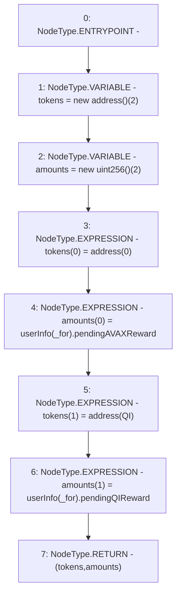

# Context: WBQI.getPendingRewards

**Contract:** `WBQI` (Inherits: IWAsset, ERC20_8, IERC20)
**Signature:** `getPendingRewards(address) returns (address[], uint256[])`
**Method Selector ID:** `0xf6ed2017`
**Visibility:** `external`
**Environment-Free:** `Yes`
**Modifiers:** None

### State Variables Interaction
- **Reads:** QI, userInfo
- **Writes:** None

### Environment & Verification Flags
- **Uses Foundry Cheatcodes:** No
- **Has Echidna Properties:** No

### Internal Calls Tree
- None

### External Calls / Value Transfers
- None

### Control Flow Graph (CFG)


### Source Mapping
Declared in: `certora-ac-datasets/detasets/web3bugs/dataset/web3bugs/66/packages/contracts/contracts/AssetWrappers/WBQI.sol` on lines **202** to **212**

```solidity
    function getPendingRewards(address _for) external view override returns
        (address[] memory, uint[] memory)  {
     
        address[] memory tokens = new address[](2);
        uint[] memory amounts = new uint[](2);
        tokens[0] = address(0);
        amounts[0] = userInfo[_for].pendingAVAXReward;
        tokens[1] = address(QI);
        amounts[1] = userInfo[_for].pendingQIReward;
        return (tokens, amounts);
    }

```
