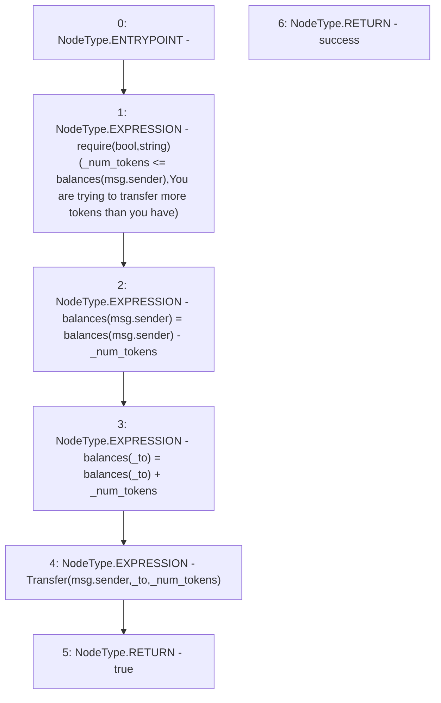

# Context: WBQI.transfer

**Contract:** `WBQI` (Inherits: IWAsset, ERC20_8, IERC20)
**Signature:** `transfer(address,uint256) returns (bool)`
**Method Selector ID:** `0xa9059cbb`
**Visibility:** `public`
**Environment-Free:** `No (reads EVM state context)`
**Modifiers:** None

### State Variables Interaction
- **Reads:** balances
- **Writes:** balances

### Assertion Checks & Business Requirements
- require/assert: `require(bool,string)(_num_tokens <= balances[msg.sender],You are trying to transfer more tokens than you have)`

### Environment & Verification Flags
- **Uses Foundry Cheatcodes:** No
- **Has Echidna Properties:** No

### Internal Calls Tree
- None

### External Calls / Value Transfers
- `TMP_25(None) = SOLIDITY_CALL require(bool,string)(TMP_24,You are trying to transfer more tokens than you have)`

### Control Flow Graph (CFG)


### Source Mapping
Declared in: `certora-ac-datasets/detasets/web3bugs/dataset/web3bugs/66/packages/contracts/contracts/AssetWrappers/ERC20_8.sol` on lines **65** to **72**

```solidity
    function transfer(address _to, uint _num_tokens) public virtual override returns (bool success) {
        require(_num_tokens <= balances[msg.sender], "You are trying to transfer more tokens than you have");

        unchecked { balances[msg.sender] = balances[msg.sender] - _num_tokens; } // pre checked that you have enough tokens
        balances[_to] = balances[_to] + _num_tokens;
        emit Transfer(msg.sender, _to, _num_tokens);
        return true;
    }

```
