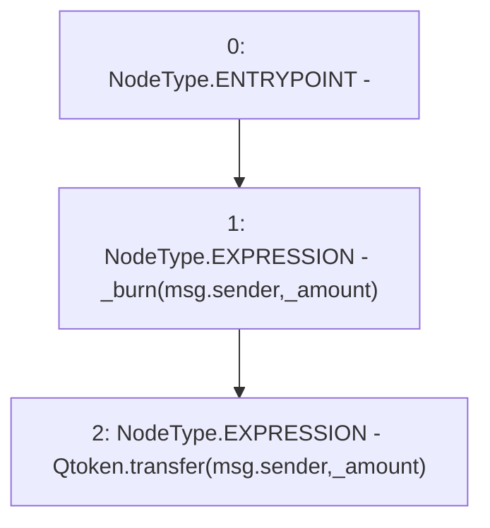

# Context: WBQI.unwrap

**Contract:** `WBQI` (Inherits: IWAsset, ERC20_8, IERC20)
**Signature:** `unwrap(uint256)`
**Method Selector ID:** `0xde0e9a3e`
**Visibility:** `external`
**Environment-Free:** `No (reads EVM state context)`
**Modifiers:** None

### State Variables Interaction
- **Reads:** Qtoken
- **Writes:** None

### Environment & Verification Flags
- **Uses Foundry Cheatcodes:** No
- **Has Echidna Properties:** No

### Internal Calls Tree
- None

### External Calls / Value Transfers
- `IERC20.TMP_96(bool) = HIGH_LEVEL_CALL, dest:Qtoken(IERC20), function:transfer, arguments:['msg.sender', '_amount']  `

### Control Flow Graph (CFG)


### Source Mapping
Declared in: `certora-ac-datasets/detasets/web3bugs/dataset/web3bugs/66/packages/contracts/contracts/AssetWrappers/WBQI.sol` on lines **150** to **153**

```solidity
    function unwrap(uint _amount) external override {
        _burn(msg.sender, _amount);
        Qtoken.transfer(msg.sender, _amount);
    }

```
