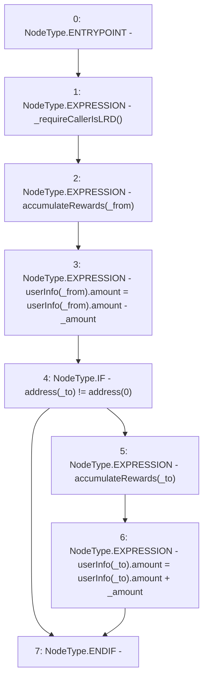

# Context: WBQI.updateReward

**Contract:** `WBQI` (Inherits: IWAsset, ERC20_8, IERC20)
**Signature:** `updateReward(address,address,uint256)`
**Method Selector ID:** `0x2c8e8dfa`
**Visibility:** `external`
**Environment-Free:** `No (reads EVM state context)`
**Modifiers:** None

### State Variables Interaction
- **Reads:** userInfo
- **Writes:** userInfo

### Environment & Verification Flags
- **Uses Foundry Cheatcodes:** No
- **Has Echidna Properties:** No

### Internal Calls Tree
- None

### External Calls / Value Transfers
- None

### Control Flow Graph (CFG)


### Source Mapping
Declared in: `certora-ac-datasets/detasets/web3bugs/dataset/web3bugs/66/packages/contracts/contracts/AssetWrappers/WBQI.sol` on lines **190** to **199**

```solidity
    function updateReward(address _from, address _to, uint _amount) external override {
        _requireCallerIsLRD();
       
        accumulateRewards(_from);
        userInfo[_from].amount = userInfo[_from].amount - _amount;
        if (address(_to) != address(0)) {
            accumulateRewards(_to);
            userInfo[_to].amount = userInfo[_to].amount + _amount;
        }
    }

```
